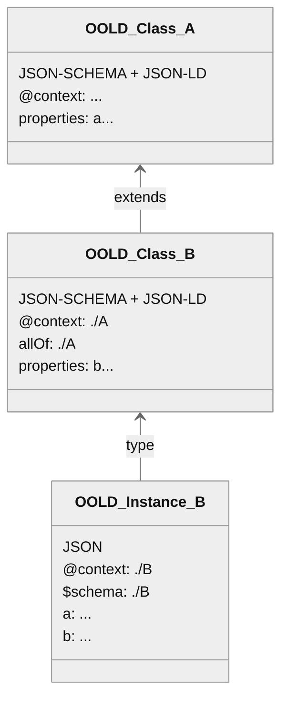

[](https://doi.org/10.5281/zenodo.11401726  )

- [OO-LD Schema](#oo-ld-schema)
  - [Overview](#overview)
  - [Introduction](#introduction)
    - [Conventions and Terminology](#conventions-and-terminology)
    - [Design Goals and Rationale](#design-goals-and-rationale)
      - [Compatibility](#compatibility)
      - [Expressiveness](#expressiveness)
      - [Interoperability](#interoperability)
  - [Basic Concepts](#basic-concepts)
  - [Composition](#composition)
  - [Schema Instances](#schema-instances)
  - [Standard extensions](#standard-extensions)
    - [JSON-LD](#json-ld)
      - [Multi-Mapping](#multi-mapping)
    - [JSON-SCHEMA](#json-schema)
      - [Multilanguange support](#multilanguange-support)
      - [Range of properties](#range-of-properties)
        - [Draft v0.1:](#draft-v01)
        - [Draft v0.2:](#draft-v02)
          - [Inline type restriction](#inline-type-restriction)
          - [Reference to existing schema](#reference-to-existing-schema)
      - [UI Generation](#ui-generation)
  - [Code Generation](#code-generation)
    - [Python](#python)
  - [Tooling](#tooling)
  - [IANA Considerations](#iana-considerations)
    - [Security considerations](#security-considerations)
  - [Registry](#registry)
  - [Discussion](#discussion)
  - [Normative References](#normative-references)
  - [Informative References](#informative-references)
- [Appendix](#appendix)
  - [Related Work](#related-work)
    - [Schema](#schema)
    - [Data](#data)
  - [Mappings](#mappings)
    - [NOMAD](#nomad)
    - [Dlite](#dlite)

# OO-LD Schema
The Object Oriented Linked Data Schema based on [JSON-LD](#JSONLD11) and [JSON-SCHEMA](#JSONSCHEMA202012) - work in process!

## Overview

OO-LD Schema aims to connect the structural modelling of objects and subobjects with the modelling of the semantic relations without reinventing the wheel. It therefor combines existing standards, primary [JSON-SCHEMA](https://json-schema.org/) and a [JSON-LD](https://json-ld.org/) context in the same document.


> JSON, JSON-SCHEMA and JSON-LD technology stack with [OpenSemanticLab](https://github.com/OpenSemanticLab) as example document store / platform

## Introduction

### Conventions and Terminology
The key words "MUST", "MUST NOT", "REQUIRED", "SHALL", "SHALL NOT", "SHOULD", "SHOULD NOT", "RECOMMENDED", "MAY", and "OPTIONAL" in this document are to be interpreted as described in [RFC 2119](#RFC2119).

### Design Goals and Rationale
#### Compatibility
An OO-LD document is always a valid JSON document. This ensures that all of the standard JSON libraries work seamlessly with OO-LD documents.

An OO-LD instance document is always a valid JSON-LD document. This ensures that all of the standard JSON-LD libraries work seamlessly with OO-LD instance documents.

An OO-LD schema document is always both a valid JSON-SCHEMA document and JSON-LD remote context. This ensures that all of the standard JSON-SCHEMA and JSON-LD libraries work seamlessly with OO-LD schema documents.

#### Expressiveness
A OO-LD schema document allows the developer to express the syntax of a JSON instance document side by side with its semantics in a single source.

In addition, syntactical and semantic definitions can also be applied to referenced external JSON instance documents. 

This allows to specify well-defined patterns in a directed graph and enables tools relying on a hierarchical object structure to produce data for and consume data from such a graph.

#### Interoperability

OO-LD schema documents allow to specify all information that is needed to automatically transform data between semantically equivalent but syntactically different notations.

## Basic Concepts

If you are not familiar yet with [JSON-SCHEMA](https://json-schema.org/) or [JSON-LD](https://json-ld.org/) you should first have a look at dedicated tutorials like [OSW JSON-SCHEMA Tutorial](https://opensemantic.world/wiki/Item:OSWf4a9514baed04859a4c6c374a7312f10) and [OSW JSON-LD Tutorial](https://opensemantic.world/wiki/Item:OSW911488771ea449a6a34051f8213d7f2f).

The core idea is that an OO-LD document is always both a valid JSON-SCHEMA and a reference-able JSON-LD remote context as defined in [JSON-LD v1.1 section 3.1](https://www.w3.org/TR/2020/REC-json-ld11-20200716/#the-context) ( != JSON-LD document). In this way a complete OO-LD class / schema hierarchy is consume-able by JSON-SCHEMA-only and JSON-LD-only tools while OO-LD aware tools can provide extended features on top (e.g. UI autocomplete dropdowns for string-IRI fields based e.g. on a SPARQL backend, SHACL shape or JSON-LD frame generation).

A minimal example:
```json
{
  "@context": {
    "schema": "http://schema.org/",
    "name": "schema:name"
  },
  "title": "Person",
  "type": "object",
  "properties": {
    "name": {
      "type": "string",
      "description": "First and Last name"
    }
  }
}
```

You can explore this in the [interactive playground](https://oo-ld.github.io/playground/)

Please note that **OO-LD schema documents MUST NOT be interpreted as JSON-LD documents** because this would apply `@context` on the schema itself. The motivation behind this is to have a single document so schemas can be aggregated using both the JSON-SCHEMA `$ref` and the JSON-LD remote `@context` pointing the same resource.



You can read how this is implemented in OpenSemanticWorld/Lab in the [introduction](https://opensemantic.world/wiki/Item:OSWdb485a954a88465287b341d2897a84d6) and [schema documentation draft](https://opensemantic.world/wiki/Item:OSWab674d663a5b472f838d8e1eb43e6784).

## Composition

It MUST NOT be require to further process an OO-LD Schema document in order to interpret it as JSON-LD context. This implies that all occurrences of `$ref` in the schema are reflected in the JSON-LD context. `$ref` within properties of `type: object` MUST be listed as scoped JSON-LD context. `$ref` within all other property types and at the root level of the OO-LD schema MUST be listed at the root level of the JSON-LD context. In case of multiple `$ref` within `allOf` it lies within the responsibility of the importing OO-LD schema to ensure correctness of the merged remote JSON-LD context. 
This SHOULD NOT be applied to `oneOf` and `anyOf` since conflicts are more likely.
At any time the importing OO-LD schema can define its own or override the imported JSON-LD context.

```yaml
"@context"
  - B.schema.json
  - P1.schema.json
  - p1:
    "@context": P1.schema.json
  - p2:
    "@context": 
      - P2a.schema.json
      - P2b.schema.json
  - p3:
    "@context":
      keyword_in_P3a: ex:Property1
      keyword_in_P3b: ex:Property2
$id: A.schema.json
allOf:
  - $ref: B.schema.json
properties:
  p0:
    type: string
    $ref: P0.schema.json
  p1:
    type: object
    $ref: P1.schema.json
  p2:
    type: object
    allOf:
      $ref: P2a.schema.json
      $ref: P2b.schema.json
  p3:
    oneOf:
      $ref: P3a.schema.json
      $ref: P3b.schema.json
```

<details>
  <summary>Full example</summary>

```yaml
"@context": 
  name: ex:petName
$id: Pet.schema.json
properties:
  name:
    type: string
```

```yaml
"@context": 
  name: schema:name
  pets:
    "@id": ex:hasPet
    "@context": Pet.schema.json
$id: Person.schema.json
properties:
  name:
    type: string
  pets:
    type: array
    items: 
      $ref: Pet.schema.json
```

```yaml
"@context": Person.schema.json
$schema: Person.schema.json
name: Max
pets:
  - name: Bruno
```

```yaml
"@context": 
  name: ex:name
  pets:
    "@id": ex:hasPet
    "@context":
      name: ex:petName
$schema: Person.schema.json
name: Max
pets:
  - name: Bruno
```

```ttl
_:b0 <ex:hasPet> _:b1 .
_:b0 <schema:name> "Max" .
_:b1 <ex:petName> "Bruno" .
```
</details>

## Schema Instances
https://json-schema.org/draft/2020-12/json-schema-core#name-linking-to-a-schema
https://json-schema.org/draft/2020-12/json-schema-core#name-the-schema-keyword

```yaml
"@context": Person.schema.json
$schema: Person.schema.json
```

## Standard extensions
### JSON-LD
Current support covers [v1.1] (https://www.w3.org/TR/json-ld/).

#### Multi-Mapping
JSON-LD allows only a single keyword-IRI mapping (or more precisely, ignores all but the last mapping). Currently there is no way to express that a property has two ids (e. g. with `"label": {"@id": ["schema:name", "skos:prefLabel"]}`, see also [json-ld/json-ld.org#160](https://github.com/json-ld/json-ld.org/issues/160)). As a workaround, an additional context notation is provided: `<property>*(*)` pointing to additional `@id` mappings to provide at least a documentation for alternative options or custom RDF generation.

see also: https://github.com/OO-LD/schema/issues/12

```json
{
    "@context": [
        {
            "@version": 1.1,
            "skos": "https://www.w3.org/TR/skos-reference/",
            "schema": "https://schema.org/",
            "label": "skos:prefLabel",
            "label*": "schema:name",
            "label**": "..."
        }
    ],
    "label": "test"
}
```

Default JSON-LD processing would only interpret the preferred mapping:
```ttl
_:b0 <skos:prefLabel> "test" .
```

An OO-LD aware convert could also produce redundant triples for interoperability reasons:
```ttl
_:b0 <skos:prefLabel> "test" .
_:b0 <schema:name> "test" .
```

Furthermore, this notation can be used for data transformation and normalization, see https://github.com/OO-LD/schema/issues/11


### JSON-SCHEMA
Current support covers [Draft 4] (https://json-schema.org/specification-links#draft-4).

#### Multilanguange support
Keywords `title` and `description` can be extended with additional keywords `title*` and `description*`, which hold and object with lang-keys (de, en, etc.) pointing to the translated strings.
Mapping of `title*[lang]` must be provided by schema preprocessing.
```json
{
    "title": "Default Title",
    "title*": {"en": "Title (en)", "de": "Titel (de)"}
}
```

#### Range of properties
JSON-SCHEMA itself supports linked data only in form of subobject. References to independent external object are just URL-strings without any further restrictions. To express constrains on the type of the object as we know it from OWL and SHACL the keyword `range` is introduced (see also [json-schema-org/json-schema-vocabularies#55](https://github.com/json-schema-org/json-schema-vocabularies/issues/55)). Note: Same as `$ref`, `range` must point to a resolvable resource.

##### Draft v0.1:

`range` is an IRI. While this is concise, there's no way to express unions and intersections of multiple schemas.

```json
{
  "@context": {
    "schema": "http://schema.org/",
    "works_for": "schema:worksFor"
  },
  "title": "Person",
  "type": "object",
  "properties": {
    "works_for": {
      "type": "string",
      "range": "schema:Organization",
      "description": "IRI pointing to an instance of schema:Organization",
    }
  }
}
```

##### Draft v0.2:

`range` is an OO-LD schema. By using `...Of` keywords, unions (`anyOf` / `oneOf`) and intersections (`allOf`) of multiple schemas can be expressed.

This will allow the following constellations:

###### Inline type restriction
```json
"range": {
  "@context": {
    "schema": "http://schema.org/",
    "type": "@type"
  },
  "properties": {
    "type": {
      "type": "string",
      "const": "schema:Organization",
    }
  }
}
```


###### Reference to existing schema
```json
"range": {
  "allOf": {
    "$ref": "Organization.schema.json"
  }
}
```
<details>
<summary>Full Example:</summary>

```json
{
  "@context": {
    "schema": "http://schema.org/",
    "works_for": "schema:worksFor",
    "type": "@type"
  },
  "$id": "Person.schema.json",
  "title": "Person",
  "type": "object",
  "properties": {
    "type": {
      "type": "string",
      "const": "schema:Person",
    },
    "works_for": {
      "type": "string",
      "range": {
        "allOf": {
          "$ref": "Organization.schema.json"
        }
      },
      "description": "IRI pointing to an instance of schema:Organization",
    }
  }
}
```

```json
{
  "@context": {
    "schema": "http://schema.org/",
    "type": "@type"
  },
  "$id": "Organization.schema.json",
  "title": "Organization",
  "type": "object",
  "properties": {
    "type": {
      "type": "string",
      "const": "schema:Organization",
    }
  }
}
```
</details>

On the downside, `range` may build up large schema graphs with circular paths which can raise issues in JSON-SCHEMA bundlers following all `$ref` relations. However, [JSON-SCHEMA]{#JSONSCHEMA202012} recommends standard bundlers not to follow `$ref` within custom keywords in [section 9.4.2](https://json-schema.org/draft/2020-12/json-schema-core#name-references-to-possible-non-). See also https://json-schema.org/blog/posts/bundling-json-schema-compound-documents.


#### UI Generation
Additional keywords defined by [JSON-SCHEMA Editor](https://github.com/json-editor/json-editor), see [Basic features](https://github.com/json-editor/json-editor#readme) and [Further details](https://github.com/json-editor/json-editor/blob/master/README_ADDON.md)

## Code Generation

In general we want to keep keywords in 'instance' JSON-documents (=> property names in schemas) strict `^[A-z_]+[A-z0-9_]*$` to avoid escaping or replacing when mapping to other languages. This works well with [aliasing](https://www.w3.org/TR/json-ld11/#aliasing-keywords), e.g.
```json
{
  "@context": {
    "schema": "http://schema.org/",
    "name": "schema:name",
    "type": "@type"
  },
  "title": "Person",
  "type": "object",
  "properties": {
    "type": {
      "type": "string",
      "default": "schema:Person",
    },
    "name": {
      "type": "string",
      "description": "First and Last name",
    }
  }
}
```

### Python

The Person schema above translates smoothly to python (pydantic) via https://github.com/koxudaxi/datamodel-code-generator:
```python
class Person(BaseModel):
    type: Optional[str] = "schema:Person"
    name: Optional[str] = None
    """First and Last name"""
```
what would not be the case if we use `@type` or `schema:name` as property names (See also [python playground](https://oo-ld.github.io/playground-python-yaml/)).
From pydantic it's also straight forward to [generate JSON- / OpenAPI-Schemas](https://docs.pydantic.dev/latest/concepts/json_schema/), especially via [FastAPI](https://fastapi.tiangolo.com/features/).

## Tooling
* General
  * [JSON-LD Tooling](https://json-ld.org/#developers)
  * [JSON-SCHEMA Tooling](https://json-schema.org/implementations)
* OO-LD Specific
  * Python: [oold-python](https://github.com/OpenSemanticWorld/oold-python)
  * Javascript Framework for graph visualization and editing: [interactive-semantic-graph](https://github.com/OpenSemanticLab/interactive-semantic-graph)
  * Fully integrated platform (currently) based on Semantic Mediawiki: [docker-compose](https://github.com/OpenSemanticLab/osl-mw-docker-compose), [Demo](https://demo.open-semantic-lab.org/wiki/Main_Page)

## IANA Considerations
| Slot | File extension (recommended) | Media type | RFC6906 profile | Description
| -- | --| -- | -- | -- |
| schema |*.schema.json | `application/oold-schema+json` | - | Full OO-LD schema
| schema |*.schema.json | `application/oold-schema+json` | oold-schema#bundled | Full OO-LD schema with all `$ref` and remote context bundled
| schema |*.schema.json | `application/oold-schema+json` | http://www.w3.org/ns/json-ld#context | Only the JSON-LD context
| schema |*.schema.json | `application/ld+json` | - | Only the JSON-LD context
| schema |*.schema.json | `application/schema+json` | - | Only the JSON-SCHEMA schema
| data |*.data.json | `application/oold-schema-instance+json` | - | Full OO-LD instance
| data |*.data.json | `application/ld+json` | http://www.w3.org/ns/json-ld#* | Full OO-LD instance. Profiles defined in https://www.w3.org/TR/json-ld/#iana-considerations apply
| data |*.data.json | `application/json` | - | Only the JSON data

### Security considerations
Both security consideration of [JSON-LD v1.1 section C](https://www.w3.org/TR/2020/REC-json-ld11-20200716/#iana-considerations) and [JSON-SCHEMA 2020-12 section 13](https://json-schema.org/draft/2020-12/json-schema-core#section-13) apply.

## Registry
* [OpenSemanticWorld Package Registry](https://github.com/OpenSemanticWorld-Packages), deployed e. g. [OpenSemanticWorld](https://opensemantic.world/)

## Discussion
* In the context of YAML-LD: https://github.com/json-ld/yaml-ld/issues/19

## Normative References

|||
| - | - |
| <a id="RFC2119"></a>RFC 2119 | Bradner, S., "Key words for use in RFCs to Indicate Requirement Levels", BCP 14, RFC 2119, DOI 10.17487/RFC2119, March 1997, <https://www.rfc-editor.org/info/rfc2119>. 
| <a id="RFC8259"></a>RFC 8259 | Bray, T., Ed., "The JavaScript Object Notation (JSON) Data Interchange Format", STD 90, RFC 8259, DOI 10.17487/RFC8259, December 2017, <https://www.rfc-editor.org/info/rfc8259>. 
| <a id="JSONLD11"></a>JSON-LD | https://www.w3.org/TR/2020/REC-json-ld11-20200716/
| <a id="JSONSCHEMA202012"></a>JSON-SCHEMA | https://json-schema.org/draft/2020-12/json-schema-core
| <a id="LDP"></a>W3C.REC-ldp-20150226 | Speicher, S., Arwe, J., and A. Malhotra, "Linked Data Platform 1.0", World Wide Web Consortium Recommendation REC-ldp-20150226, 26 February 2015, <https://www.w3.org/TR/2015/REC-ldp-20150226>. 

## Informative References

|||
| - | - |
| <a id="RFC7049"></a>RFC 7049 | Bormann, C. and P. Hoffman, "Concise Binary Object Representation (CBOR)", RFC 7049, DOI 10.17487/RFC7049, October 2013, <https://www.rfc-editor.org/info/rfc7049>.


# Appendix

## Related Work


> OO-LD as bridge between linked data and the general software domain

### Schema
| Name      | Description |
| ----------- | ----------- |
| [JSON-SCHEMA](https://json-schema.org/) | Base of this work. Does not include linked data concepts. |
| [JSON-LD](https://json-ld.org/) | Base of this work. Does not restrict the structure of a json file. |
| [OWL](https://www.w3.org/TR/2012/REC-owl2-quick-reference-20121211/) | Focus on logical modelling. Only applicable to RDF.  |
| [SHACL](https://www.w3.org/TR/shacl/) | Only applicable to RDF. |
| [Asset Administration Shell](https://github.com/admin-shell-io/aas-specs) | Industry 4.0 related data schema for assets |
| [Semantic Aspect Meta Model](https://eclipse-esmf.github.io/samm-specification/2.0.0/index.html) | SHACL subset written in turtl, e. g. used for the [data models in Catena-X](https://github.com/eclipse-tractusx/sldt-semantic-models)
| [SmartDataModels](https://smartdatamodels.org/) | JSON-SCHEMA defined data models used by  FIWARE Foundation, TM Forum, OASC and IUDX |
| [Common Data Model](https://eclipse-esmf.github.io/samm-specification/2.0.0/index.html) | Business related data models developed by Microsoft |
| [LinkML](https://github.com/linkml/linkml/issues/1618) | Custom schema language focussed on data modelling. Both [importers](https://linkml.io/schema-automator/packages/importers.html) and [exporters](https://linkml.io/linkml/generators/index.html) to JSON-SCHEMA (and others) exists. Custom annotations for UI generation not (yet) supported (see [#1618](https://github.com/linkml/linkml/issues/1618)). |
| [TreeLDR](https://www.spruceid.dev/treeldr/treeldr-overview) | Custom linked data schema language that can be converted to JSON-SCHEMA, JSON-LD context, RDF and Rust code |
| [REST-API-LD](https://datatracker.ietf.org/doc/draft-polli-restapi-ld-keywords/03/) | Annotated OpenAPI schemas with rendering support in [Swagger-UI](https://italia.github.io/swagger-editor/). Option to generate it from OO-LD. |
| [dlite](https://github.com/SINTEF/dlite) | Custom schema language focussed on scientific data |
| [NOMAD](http://nomad-lab.eu/prod/v1/staging/docs/schemas/basics.html) | Custom schema language focussed on scientific data |
| [Human Cell Atlas](https://data.humancellatlas.org/metadata) | Data schemas for the biology and medical domain |
| [OTTR](https://ottr.xyz/)   | Mixture of custom template and schema language. Limited toolset to convert from/to other formats. |
| [TheWorldAvatar/ObjectGraphMapper](https://github.com/cambridge-cares/TheWorldAvatar/tree/main/core/ogm) | Class-RDF Mapping in Java via decorators |

### Data
| Name      | Description |
| ----------- | ----------- |
| [BatteryKnowledgeGraph](https://github.com/BIG-MAP/BatteryKnowledgeGraph) | Battery related linked data set |

## Mappings

### NOMAD

[NOMAD schemas](https://sol-oasis.physik.hu-berlin.de/nomad-oasis/docs/schemas/basics.html) have compareable concepts about reusable objects (sections) with typed properties (quantities).
Example:
```yaml
definitions:
  sections:
    Element:
      quantities:
        label:
          type: str
        density:
          type: np.float64
          unit: g/cm**3
        isotopes:
          type: int
          shape: ['*']
    Composition:
      quantities:
        composition:
          type: str
      sub_sections:
        elements:
          section: Element
          repeats: true
```
can be expressed as the following JSON-SCHEMA (formated as yaml)

```yaml
definitions:
  sections:
    Element:
      properties:
        label:
          type: string
        density:
          type: number
          unit: g/cm**3
        isotopes:
          type: array
          items:
            type: integer
          format: table
    Composition:
      properties:
        composition:
          type: str
        elements:
          type: array
          format: table
          items:
            $ref: '#/definitions/sections/Element'
```

generating/validating the same JSON/YAML data (see also [playground](https://oo-ld.github.io/playground-yaml/?data=N4Ig9gDgLglmB2BnEAuUMDGCA2MBGqIAZglAIYDuApomALZUCsIANOHgFZUZQD62ZAJ5gArlELwwAJzplsrEIgwALKrNSgAAlnhQqAD3FoQVbGqq7kKEMqhQIiFAHonFAMwwAJk7V0wT5TJEAAUyKXE2ATxTQlt7RxclVVkAOmkAcyd4MgYQAF82TyoiGHgYWAQrUERuCqQNEABRMwZdBogpSCpwmBoGqJjjKEEIKkJEKClS9PzCi0RywQbh0YkROmipBREyoxBMjDoAKiO3WZAYWiguqpAVseswqSEFcrVb%2B8JSvXTu85IZGQ9uQ8GZ8nkCiAAML0CBgBZ1dqdUY9PrGLB0OEIuDwZYjB6KSbnUzmSx41aPKTPJZsAGyYFkUFjNhvOi3AAkUmKhAAxE4iiVdjjEE4ajxhU5mqTxBDZZDOdzrHyBaVyhKxXURTDMfC1QgFAKyCJsEZQOyMa09gAZMBkTwAAloDHthuNUBdQLI9uu9rhEGNQKo3tU9qonnK0mQbAxWL1uOsAAkAEwAeQUJMtVgA2qABvJEwb5otUAAGFIlislgAcbgA7IwWVcbqgswBGFhJlhuAC6BVzjMGIDTcyQxZQrZSrYALO2Lk3RtnWwA2Fit2urqu93uQxDKMAUXjdTpSKwXXTdMji%2FVsKDJAl4MBgKATZ4QKcKMgcMj6VCTERUNgAGsqCoCBeAQKgwCIXgADc5H%2FKwiDkGpIQ4Wh41AGNdURRNU3TFoLGfFt%2B2ifMQATQtR2GUty0rGt60bJ9mxQNsOy7XsWBIwdhxAIoqKWcdJxnRjrgXFtl1XddW03PJuzYc16EtQgbTtR16CDV0TQ9chvTAX1IADPRgyDMMIxPcEgA%3D)), e.g.

```yaml
composition: H2O
elements:
  - label: H
    density: 8.375e-05
    isotopes: [1, 2, 3]
  - label: O
    density: 1.141
    isotopes: [16, 17, 18]
```
by using the following mapping (work in progress):

| NOMAD Schema      | JSON-Schema |  Note |
| ----------- | ----------- | ----------- |
| quantities | properties | |
| type (int, str, ...) | type (integer, string, ...) | specific python types like `np.int32` can be annotated in the JSON-LD context |
| unit, m_annotations, .. | format / options| additional custom annotation keywords can be kept or mapped to format and options |
| shape[*] | type: array, items: type: number | specific values can be mapped to minItems and maxItems |
| shape[*, *] | type: array, items: type: array, items: type: number | nested array |
| sub_sections: ... : repeats: true | type: array, items: type: object | array of objects
|... | | |


### Dlite

#### Schema

[Dlite](https://github.com/SINTEF/dlite) already uses JSON-SCHEMA keywords like `properties`, `type` and `description`. Similar to NOMAD, annotations `unit` declare the unit of measure of quantity values and `shape` is used to describe array dimensions. However, different from NOMAD, `shape` refers to parameters declared under `dimensions`.  

```yaml
uri: http://onto-ns.com/meta/0.1/Person # identifier of the schema document
meta: http://onto-ns.com/meta/0.3/EntitySchema # links to a meta schema as type
description: A person.
dimensions:
  nskills: Number of skills.
properties:
  general:
    type: $ref
    $ref: http://onto-ns.com/meta/0.1/Thing # reference to a another schema document
  name:
    type: string
    description: Full name.
  age:
    type: float32
    unit: year
    description: Age of person.
  skills:
    type: string
    shape: [nskills]
    description: List of skills.
```
> Person.dlite.yml

To overcome the missing expressivness in JSON-SCHEMA alone, specific JSON-LD `@type` annotations can be used (here `xsd:float`). `dimension`, `unit`, and `shape` can be expressed with custom keywords, prefixed by `x-dlite-`.
```yaml
"@context":
  xsd: http://www.w3.org/2001/XMLSchema
  age:
    "@type": xsd:float # see: https://www.w3.org/TR/xmlschema11-2/#float
$id: http://onto-ns.com/meta/0.1/Person
description: A person.
x-dlite-dimensions:
  nskills: Number of skills.
properties:
  name:
    type: string
    description: Full name.
  age:
    type: number
    x-dlite-unit: year
    description: Age of person.
  skills:
    type: array
    x-dlite-shape: [nskills]
    description: List of skills.
    #minItems: ? # can be set if nskills is known
    #maxItems: ? # can be set if nskills is known
    items:
      type: string
```
> Person.oold.yml

#### Instance

On the instance level the main difference is the nesting of properties within a `properties` subobject. This can be interpreted as JSON-LD [nested-properties](https://www.w3.org/TR/json-ld/#nested-properties). Links to other instance documents are UUIDs which should be interpreted as `urn:uuid`.


```yaml
"@context":
  - /remote/context/of/Person
  - properties: "@nest" # skip this level

uuid: 8cbd4c09-734d-4532-b35a-1e0dd5c3e8b5
meta: http://onto-ns.com/meta/0.1/Person # like type
properties:
  general: <UUID of a Thing instance document>
  name: Sherlock Holmes
  age: 34.0
  skills:
    - observing
    - chemistry
    - violin
    - boxind
```
> SherlockHolmes.dlite.yml

```yaml
"@context": http://onto-ns.com/meta/0.1/Person
$schema: http://onto-ns.com/meta/0.1/Person
uuid: 8cbd4c09-734d-4532-b35a-1e0dd5c3e8b5
general: urn:uuid:<UUID of a Thing instance document>
name: Sherlock Holmes
age: 34.0
skills:
  - observing
  - chemistry
  - violin
  - boxind
```
> SherlockHolmes.oold.yml
