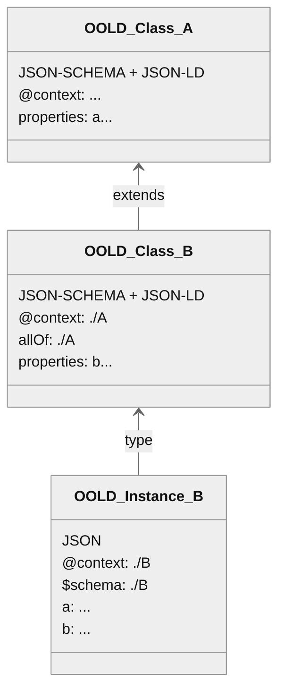

# OO-LD Schema
The Object Oriented Linked Data Schema

## Overview

OO-LD Schema aims to connect the structural modelling of objects and subobjects with the modelling of the semantic relations without reinventing the wheel. It therefor combines existing standards, primary [JSON-SCHEMA](https://json-schema.org/) and a [JSON-LD](https://json-ld.org/) context in the same document.

> JSON, JSON-SCHEMA and JSON-LD technology stack with [OpenSemanticLab](https://github.com/OpenSemanticLab) as example document store / platform

## Quickstart

Schemas can be aggregated using both the JSON-SCHEMA `$ref` and the JSON-LD remote `@context` pointing the same resource.

## Tooling
* General
  * [JSON-LD Tooling](https://json-ld.org/#developers)
  * [JSON-SCHEMA Tooling](https://json-schema.org/implementations)
* OO-LD Specific
  * Python: [oold-python](https://github.com/OpenSemanticWorld/oold-python)
  * Javascript Framework for graph visualization and editing: [interactive-semantic-graph](https://github.com/OpenSemanticLab/interactive-semantic-graph)
  * Fully integrated platform (currently) based on Semantic Mediawiki: [docker-compose](https://github.com/OpenSemanticLab/osl-mw-docker-compose), [Demo](https://demo.open-semantic-lab.org/wiki/Main_Page)

## Registry
* [OpenSemanticWorld Package Registry](https://github.com/OpenSemanticWorld-Packages), deployed e. g. [OpenSemanticWorld](https://opensemantic.world/)

## Related Work

> OO-LD as bridge between linked data and the general software domain

| Name      | Description |
| ----------- | ----------- |
| [JSON-SCHEMA](https://json-schema.org/) | Base of this work. Does not include linked data concepts. |
| [JSON-LD](https://json-ld.org/) | Base of this work. Does not restrict the structure of a json file. |
| [OWL](https://www.w3.org/TR/2012/REC-owl2-quick-reference-20121211/) | Focus on logical modelling. Only applicable to RDF.  |
| [SHACL](https://www.w3.org/TR/shacl/) | Only applicable to RDF. |
| [LinkML](https://github.com/linkml/linkml/issues/1618) | Custom schema language focussed on data modelling. Both [importers](https://linkml.io/schema-automator/packages/importers.html) and [exporters](https://linkml.io/linkml/generators/index.html) to JSON-SCHEMA (and others) exists. Custom annotations for UI generation not (yet) supported (see [#1618](https://github.com/linkml/linkml/issues/1618)). |
| [dlite](https://github.com/SINTEF/dlite) | Custom schema language focussed on scientific data |
| [NOMAD](http://nomad-lab.eu/prod/v1/staging/docs/schemas/basics.html) | Custom schema language focussed on scientific data |
| [OTTR](https://ottr.xyz/)   | Mixture of custom template and schema language. Limited toolset to convert from/to other formats. |

