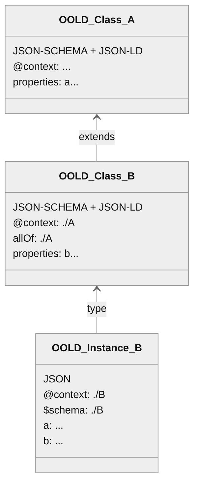

# OO-LD Schema
The Object Oriented Linked Data Schema - work in process!

## Overview

OO-LD Schema aims to connect the structural modelling of objects and subobjects with the modelling of the semantic relations without reinventing the wheel. It therefor combines existing standards, primary [JSON-SCHEMA](https://json-schema.org/) and a [JSON-LD](https://json-ld.org/) context in the same document.


> JSON, JSON-SCHEMA and JSON-LD technology stack with [OpenSemanticLab](https://github.com/OpenSemanticLab) as example document store / platform

## Quickstart

If you are not familiar yet with [JSON-SCHEMA](https://json-schema.org/) or [JSON-LD](https://json-ld.org/) you should first have a look at dedicated tutorials like [OSW JSON-SCHEMA Tutorial](https://opensemantic.world/wiki/Item:OSWf4a9514baed04859a4c6c374a7312f10) and [OSW JSON-LD Tutorial](https://opensemantic.world/wiki/Item:OSW911488771ea449a6a34051f8213d7f2f).

A minimal example:
```json
{
  "@context": {
    "schema": "http://schema.org/",
    "name": "schema:name"
  },
  "title": "Person",
  "type": "object",
  "properties": {
    "name": {
      "type": "string",
      "description": "First and Last name",
    }
  }
}
```

You can explore this in the [interactive playground](https://oo-ld.github.io/playground/)

Schemas can be aggregated using both the JSON-SCHEMA `$ref` and the JSON-LD remote `@context` pointing the same resource.



You can read how this is implemented in OpenSemanticWorld/Lab in the [introduction](https://opensemantic.world/wiki/Item:OSWdb485a954a88465287b341d2897a84d6) and [schema documentation draft](https://opensemantic.world/wiki/Item:OSWab674d663a5b472f838d8e1eb43e6784).

More details tbd...

## Standard extensions
### JSON-LD
Current support covers [v1.1] (https://www.w3.org/TR/json-ld/).

#### Multi-Mapping
JSON-LD allows only a single keyword-IRI mapping (or more precisely, ignores all but the last mapping). Currently there is no way to express that a property has two ids (e. g. with `"label": {"@id": ["schema:name", "skos:prefLabel"]}`, see also [json-ld/json-ld.org#160](https://github.com/json-ld/json-ld.org/issues/160)). As a workaround, an additional context notation is provided: `<property>*(*)` pointing to additional `@id` mappings to provide at least a documentation for alternative options or custom RDF generation.

```json
{
    "@context": [
        {
            "@version": 1.1,
            "skos": "https://www.w3.org/TR/skos-reference/",
            "schema": "https://schema.org/",
            "label": "skos:prefLabel",
            "label*": "schema:name",
            "label**": "..."
        }
    ]
}
```

### JSON-SCHEMA
Current support covers [Draft 4] (https://json-schema.org/specification-links#draft-4).

#### Multilanguange support
Keywords `title` and `description` can be extended with additional keywords `title*` and `description*`, which hold and object with lang-keys (de, en, etc.) pointing to the translated strings.
Mapping of `title*[lang]` must be provided by schema preprocessing.
```json
{
    "title": "Default Title",
    "title*": {"en": "Title (en)", "de": "Titel (de)"}
}
```

#### Range of properties
JSON-SCHEMA itself supports linked data only in form of subobject. References to independent external object are just URL-strings without any further restrictions. To express constrains on the type of the object as we know it from OWL and SHACL the keyword `range` is introduced (see also [json-schema-org/json-schema-vocabularies#55](https://github.com/json-schema-org/json-schema-vocabularies/issues/55)). Note: Same as `$ref`, `range` must point to a resolvable resource.

```json
{
  "@context": {
    "schema": "http://schema.org/",
    "works_for": "schema:worksFor"
  },
  "title": "Person",
  "type": "object",
  "properties": {
    "works_for": {
      "type": "string",
      "range": "schema:Organization",
      "description": "IRI pointing to an instance of schema:Organization",
    }
  }
}
```

#### UI Generation
Additional keywords defined by [JSON-SCHEMA Editor](https://github.com/json-editor/json-editor), see [Basic features](https://github.com/json-editor/json-editor#readme) and [Further details](https://github.com/json-editor/json-editor/blob/master/README_ADDON.md)


## Tooling
* General
  * [JSON-LD Tooling](https://json-ld.org/#developers)
  * [JSON-SCHEMA Tooling](https://json-schema.org/implementations)
* OO-LD Specific
  * Python: [oold-python](https://github.com/OpenSemanticWorld/oold-python)
  * Javascript Framework for graph visualization and editing: [interactive-semantic-graph](https://github.com/OpenSemanticLab/interactive-semantic-graph)
  * Fully integrated platform (currently) based on Semantic Mediawiki: [docker-compose](https://github.com/OpenSemanticLab/osl-mw-docker-compose), [Demo](https://demo.open-semantic-lab.org/wiki/Main_Page)

## Registry
* [OpenSemanticWorld Package Registry](https://github.com/OpenSemanticWorld-Packages), deployed e. g. [OpenSemanticWorld](https://opensemantic.world/)

## Related Work


> OO-LD as bridge between linked data and the general software domain
> 
### Schema
| Name      | Description |
| ----------- | ----------- |
| [JSON-SCHEMA](https://json-schema.org/) | Base of this work. Does not include linked data concepts. |
| [JSON-LD](https://json-ld.org/) | Base of this work. Does not restrict the structure of a json file. |
| [OWL](https://www.w3.org/TR/2012/REC-owl2-quick-reference-20121211/) | Focus on logical modelling. Only applicable to RDF.  |
| [SHACL](https://www.w3.org/TR/shacl/) | Only applicable to RDF. |
| [Asset Administration Shell](https://github.com/admin-shell-io/aas-specs) | Industry 4.0 related data schema for assets |
| [Semantic Aspect Meta Model](https://eclipse-esmf.github.io/samm-specification/2.0.0/index.html) | SHACL subset written in turtl, e. g. used for the [data models in Catena-X](https://github.com/eclipse-tractusx/sldt-semantic-models)
| [Common Data Model](https://eclipse-esmf.github.io/samm-specification/2.0.0/index.html) | Business related data models developed by Microsoft |
| [LinkML](https://github.com/linkml/linkml/issues/1618) | Custom schema language focussed on data modelling. Both [importers](https://linkml.io/schema-automator/packages/importers.html) and [exporters](https://linkml.io/linkml/generators/index.html) to JSON-SCHEMA (and others) exists. Custom annotations for UI generation not (yet) supported (see [#1618](https://github.com/linkml/linkml/issues/1618)). |
| [dlite](https://github.com/SINTEF/dlite) | Custom schema language focussed on scientific data |
| [NOMAD](http://nomad-lab.eu/prod/v1/staging/docs/schemas/basics.html) | Custom schema language focussed on scientific data |
| [Human Cell Atlas](https://data.humancellatlas.org/metadata) | Data schemas for the biology and medical domain |
| [OTTR](https://ottr.xyz/)   | Mixture of custom template and schema language. Limited toolset to convert from/to other formats. |
| [BatteryKnowledgeGraph](https://github.com/BIG-MAP/BatteryKnowledgeGraph) | Battery related linked data set |

### Data
| Name      | Description |
| ----------- | ----------- |
| [BatteryKnowledgeGraph](https://github.com/BIG-MAP/BatteryKnowledgeGraph) | Battery related linked data set |

