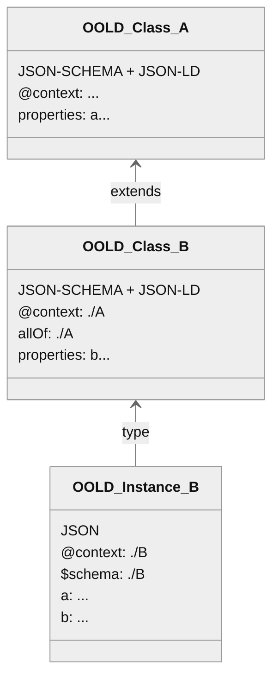

[](https://doi.org/10.5281/zenodo.11401726            )

- [OO-LD Schema](#oo-ld-schema)
  - [Overview](#overview)
  - [Introduction](#introduction)
    - [Conventions and Terminology](#conventions-and-terminology)
    - [Design Goals and Rationale](#design-goals-and-rationale)
      - [Compatibility](#compatibility)
      - [Expressiveness](#expressiveness)
      - [Interoperability](#interoperability)
  - [Basic Concepts](#basic-concepts)
  - [Composition](#composition)
    - [Merging remote contexts](#merging-remote-contexts)
  - [Schema Instances](#schema-instances)
  - [Standard extensions](#standard-extensions)
    - [JSON-LD](#json-ld)
      - [Processing mode (@version)](#processing-mode-version)
      - [Multi-Mapping](#multi-mapping)
    - [JSON-SCHEMA](#json-schema)
      - [Multilanguage support](#multilanguage-support)
        - [Localizing schema annotations](#localizing-schema-annotations)
        - [Localizing instance values](#localizing-instance-values)
      - [Range of properties](#range-of-properties)
        - [Why x-oold-ref and not $ref](#why-x-oold-ref-and-not-ref)
      - [Reverse properties](#reverse-properties)
      - [UI Generation](#ui-generation)
  - [Usecases](#usecases)
    - [Code Generation](#code-generation)
      - [Python](#python)
    - [Workflows and Code Analysis](#workflows-and-code-analysis)
    - [Integration with Large Language Models](#integration-with-large-language-models)
    - [Delivery to OpenAPI, MCP and LLM tooling](#delivery-to-openapi-mcp-and-llm-tooling)
  - [Tooling](#tooling)
    - [General](#general)
    - [OO-LD Specific](#oo-ld-specific)
    - [Playgrounds](#playgrounds)
  - [IANA Considerations](#iana-considerations)
    - [Security considerations](#security-considerations)
  - [Registry](#registry)
  - [Discussion](#discussion)
  - [Normative References](#normative-references)
  - [Informative References](#informative-references)
- [Appendix](#appendix)
  - [Related Work](#related-work)
    - [Schema](#schema)
    - [Data](#data)
  - [Mappings](#mappings)
    - [Asset Administion Shell](#asset-administion-shell)
    - [Semantic Aspect Meta Model](#semantic-aspect-meta-model)
    - [LinkML](#linkml)
    - [NOMAD](#nomad)
    - [Dlite](#dlite)
      - [Schema](#schema-1)
      - [Instance](#instance)

# OO-LD Schema
The Object Oriented Linked Data Schema based on [JSON-LD](#JSONLD11) and [JSON-SCHEMA](#JSONSCHEMA202012) - work in process!

## Overview

OO-LD Schema aims to connect the structural modelling of objects and subobjects with the modelling of the semantic relations without reinventing the wheel. It therefor combines existing standards, primary [JSON-SCHEMA](https://json-schema.org/) and a [JSON-LD](https://json-ld.org/) context in the same document.

*Why OO-LD?*
- OO-LD schema documents are supported by a wide range of existings tools (all JSON-SCHEMA and JSON-LD tooling!)
- OO-LD schema documents themself follow linked data principles to make them retrievable over the web to allow flexible schema compositions
- OO-LD schemas allow generic ex- and import of RDF
- OO-LD schemas are compatible with LLM APIs
- OO-LD schemas can be used as function (dataclasses) and API signatures (OpenAPI) 
- OO-LD schemas can be used to define graphical user interfaces, in particular forms


> JSON, JSON-SCHEMA and JSON-LD technology stack with [OpenSemanticLab](https://github.com/OpenSemanticLab) as example document store / platform

## Introduction

### Conventions and Terminology
The key words "MUST", "MUST NOT", "REQUIRED", "SHALL", "SHALL NOT", "SHOULD", "SHOULD NOT", "RECOMMENDED", "MAY", and "OPTIONAL" in this document are to be interpreted as described in [RFC 2119](#RFC2119).

### Design Goals and Rationale
#### Compatibility
An OO-LD document is always a valid JSON document. This ensures that all of the standard JSON libraries work seamlessly with OO-LD documents.

An OO-LD instance document is always a valid JSON-LD document. This ensures that all of the standard JSON-LD libraries work seamlessly with OO-LD instance documents.

An OO-LD schema document is always both a valid JSON-SCHEMA document and JSON-LD remote context. This ensures that all of the standard JSON-SCHEMA and JSON-LD libraries work seamlessly with OO-LD schema documents.

#### Expressiveness
A OO-LD schema document allows the developer to express the syntax of a JSON instance document side by side with its semantics in a single source.

In addition, syntactical and semantic definitions can also be applied to referenced external JSON instance documents. 

This allows to specify well-defined patterns in a directed graph and enables tools relying on a hierarchical object structure to produce data for and consume data from such a graph.

#### Interoperability

OO-LD schema documents allow to specify all information that is needed to automatically transform data between semantically equivalent but syntactically different notations.

## Basic Concepts

If you are not familiar yet with [JSON-SCHEMA](https://json-schema.org/) or [JSON-LD](https://json-ld.org/) you should first have a look at dedicated tutorials like [OSW JSON-SCHEMA Tutorial](https://opensemantic.world/wiki/Item:OSWf4a9514baed04859a4c6c374a7312f10) and [OSW JSON-LD Tutorial](https://opensemantic.world/wiki/Item:OSW911488771ea449a6a34051f8213d7f2f).

The core idea is that an OO-LD document is always both a valid JSON-SCHEMA and a reference-able JSON-LD remote context as defined in [JSON-LD v1.1 section 3.1](https://www.w3.org/TR/2020/REC-json-ld11-20200716/#the-context) ( != JSON-LD document). In this way a complete OO-LD class / schema hierarchy is consume-able by JSON-SCHEMA-only and JSON-LD-only tools while OO-LD aware tools can provide extended features on top (e.g. UI autocomplete dropdowns for string-IRI fields based e.g. on a SPARQL backend, SHACL shape or JSON-LD frame generation).

A minimal example:
```json
{
  "@context": {
    "schema": "http://schema.org/",
    "name": "schema:name"
  },
  "title": "Person",
  "type": "object",
  "properties": {
    "name": {
      "type": "string",
      "description": "First and Last name"
    }
  }
}
```

You can explore this in the [interactive playground](https://oo-ld.github.io/playground/)

Note the asymmetry between how schemas and instances are consumed:

- An OO-LD **schema** is consumed as a JSON-LD remote **context** (referenced by its URL from an instance's `@context`), never as a JSON-LD document. **OO-LD schema documents MUST NOT be interpreted as JSON-LD documents**, because that would apply the schema's own `@context` to the schema itself and produce incorrect triples.
- An OO-LD **instance** *is* a valid JSON-LD document and is processed as such.

This asymmetry is what lets a single document serve both as a JSON-SCHEMA `$ref` target and as a JSON-LD remote `@context` for the same resource. Concretely: an instance is processed directly as a JSON-LD document (e.g. `jsonld.toRDF(instance)`), which loads the schema as a remote context via the instance's `@context`; a schema is only ever referenced as that context and MUST NOT itself be expanded as a document (`jsonld.toRDF(schema)` would wrongly apply the schema's own `@context` to it).

The diagram below shows **inheritance**: Class B extends Class A by referencing it in both `allOf` (so JSON-Schema validators apply A's rules when validating B instances) and `@context` (so JSON-LD processors resolve A's term mappings). B instances are therefore valid A instances and carry all of A's properties alongside B's own additions.


```mermaid
%%{init: {'theme': 'neutral' } }%%
classDiagram
    class OOLD_Class_A {
        JSON-SCHEMA + JSON-LD
        @context: ...
        properties: a...
    }

    class OOLD_Class_B {
        JSON-SCHEMA + JSON-LD
        @context: ./A
        allOf: ./A
        properties: b...
    }

    class OOLD_Instance_B {
        JSON
        @context: ./B
        $schema: ./B
        a: ...
        b: ...
    }

    OOLD_Class_A <-- OOLD_Class_B: extends

    OOLD_Class_B <-- OOLD_Instance_B: type
```

You can read how this is implemented in OpenSemanticWorld/Lab in the [introduction](https://opensemantic.world/wiki/Item:OSWdb485a954a88465287b341d2897a84d6) and [schema documentation draft](https://opensemantic.world/wiki/Item:OSWab674d663a5b472f838d8e1eb43e6784).

## Composition

Composition is how an OO-LD schema incorporates multiple independent schemas, each contributing its own properties and JSON-LD term mappings, without requiring a shared parent class. This lets you build complex types by assembling reusable building blocks - for example, attaching a geolocation schema and a contact schema to a single resource type. The rules below govern how the resulting `@context` is assembled automatically, so that no post-processing step is needed.

It MUST NOT be require to further process an OO-LD Schema document in order to interpret it as JSON-LD context. This implies that all occurrences of `$ref` in the schema are reflected in the JSON-LD context. `$ref` within properties of `type: object` MUST be listed as scoped JSON-LD context. `$ref` within all other property types and at the root level of the OO-LD schema MUST be listed at the root level of the JSON-LD context. In case of multiple `$ref` within `allOf` the corresponding remote contexts are merged into an array-valued `@context` (see [Merging remote contexts](#merging-remote-contexts)). 
For `oneOf` / `anyOf` this requires care to avoid conflicts (see [Merging remote contexts](#merging-remote-contexts)).
At any time the importing OO-LD schema can define its own or override the imported JSON-LD context.

```yaml
"@context"
  - B.schema.json
  - P1.schema.json
  - p1:
    "@context": P1.schema.json
  - p2:
    "@context": 
      - P2a.schema.json
      - P2b.schema.json
  - p3:
    "@context":
      keyword_in_P3a: ex:Property1
      keyword_in_P3b: ex:Property2
$id: A.schema.json
allOf:
  - $ref: B.schema.json
properties:
  p0:
    type: string
    $ref: P0.schema.json
  p1:
    type: object
    $ref: P1.schema.json
  p2:
    type: object
    allOf:
      $ref: P2a.schema.json
      $ref: P2b.schema.json
  p3:
    oneOf:
      $ref: P3a.schema.json
      $ref: P3b.schema.json
```

<details>
  <summary>Full example</summary>

```yaml
"@context": 
  name: ex:petName
$id: Pet.schema.json
properties:
  name:
    type: string
```

```yaml
"@context": 
  name: schema:name
  pets:
    "@id": ex:hasPet
    "@context": Pet.schema.json
$id: Person.schema.json
properties:
  name:
    type: string
  pets:
    type: array
    items: 
      $ref: Pet.schema.json
```

```yaml
"@context": Person.schema.json
$schema: Person.schema.json
name: Max
pets:
  - name: Bruno
```

```yaml
"@context": 
  name: ex:name
  pets:
    "@id": ex:hasPet
    "@context":
      name: ex:petName
$schema: Person.schema.json
name: Max
pets:
  - name: Bruno
```

```ttl
_:b0 <ex:hasPet> _:b1 .
_:b0 <schema:name> "Max" .
_:b1 <ex:petName> "Bruno" .
```
</details>

### Merging remote contexts

**Multiple `$ref` (e.g. in `allOf`)** each correspond to a remote context. By the reflection rule above, the schema's own `@context` MUST list those remote contexts as an **array**, in the same order as the `allOf` members, so the schema stays usable as a context without further processing. A JSON-LD processor then resolves that array in order, later entries overriding earlier ones - "Duplicate context terms are overridden using a most-recently-defined-wins mechanism" ([JSON-LD 1.1, 4.1.5](https://www.w3.org/TR/json-ld11/#advanced-context-usage)). The schema MAY append its own context object as the last array entry to override an inherited term. The single-context `@import` keyword is an alternative only when exactly one remote context is wrapped and locally modified (it cannot contain a nested `@import`), so the array form is used for the multi-`$ref` case.

**`oneOf` / `anyOf`.** The remote contexts of `oneOf` / `anyOf` branches MAY also be reflected into the `@context`, but they MUST NOT conflict at the root - they MUST NOT map the same keyword to different IRIs there. A JSON-LD processor merges all listed contexts (most-recently-wins) and has no notion of which branch a given instance matched, so a root-level conflict would be decided by context order rather than by the branch the data conforms to.

Where branches genuinely need different mappings for the same keyword, do not place them at the root; scope them so each mapping applies only where its branch applies, using JSON-LD scoped contexts:

- **Type-scoped contexts** when the branches are distinguished by `@type`. The scoped `@context` is attached to the term used as the type value and is activated only for nodes carrying that `@type`:

  ```json
  "@context": {
    "Sensor": { "@id": "ex:Sensor", "@context": { "reading": "ex:temperature" } },
    "Gauge":  { "@id": "ex:Gauge",  "@context": { "reading": "ex:pressure" } }
  }
  ```

  Here `{ "@type": "Sensor", "reading": 21 }` maps `reading` to `ex:temperature`, while `{ "@type": "Gauge", "reading": 3 }` maps the same keyword to `ex:pressure`.

- **Property-scoped contexts** when the conflicting keyword appears under different parent properties. The mapping is attached to the parent property's term (its `@context`) and applies only within that property's value, so the same keyword can resolve differently under different parents.

**Propagation (`@propagate`).** A `$ref` inside a `type: object` property is reflected as a property-scoped context, which by default propagates into the whole subtree rooted at that property ("By default ... contexts propagate across node objects, other than for type-scoped contexts, which default to false"). Where a referenced context should apply only to the immediate node, the schema MUST set `"@propagate": false` on that scoped context. Contexts combined in a single array MUST share the same `@propagate` value.

**Protected terms (`@protected`).** A schema MAY mark terms `@protected` to prevent later contexts from silently redefining them. When contexts are combined via `allOf`, redefining a protected term to a different IRI is an error unless the new definition is identical; property-scoped contexts are exempt and may override protected terms within their subtree. Relying on `@protected` therefore constrains which schemas a schema can be combined with.

**Independent references and base URIs.** A JSON-SCHEMA `$ref` and a JSON-LD `@context` entry are independent references: they MAY point to the same document (the typical OO-LD case, where one document is both a schema and a context) or to different documents - for example a plain JSON-SCHEMA referenced via `$ref` together with a separate remote `@context` that supplies the semantics. Relative references resolve against the schema's `$id` (the JSON-SCHEMA base URI) and, on the JSON-LD side, against `@base` / the retrieval URL; these base URIs SHOULD be aligned so a relative reference resolves to the same absolute URL under both. `$id` MUST NOT contain a non-empty fragment ([JSON-SCHEMA Core 8.2.1](https://json-schema.org/draft/2020-12/json-schema-core#section-8.2.1)).

### Merging remote contexts

**Multiple `$ref` (e.g. in `allOf`)** each correspond to a remote context. By the reflection rule above, the schema's own `@context` MUST list those remote contexts as an **array**, in the same order as the `allOf` members, so the schema stays usable as a context without further processing. A JSON-LD processor then resolves that array in order, later entries overriding earlier ones - "Duplicate context terms are overridden using a most-recently-defined-wins mechanism" ([JSON-LD 1.1, 4.1.5](https://www.w3.org/TR/json-ld11/#advanced-context-usage)). The schema MAY append its own context object as the last array entry to override an inherited term. The single-context `@import` keyword is an alternative only when exactly one remote context is wrapped and locally modified (it cannot contain a nested `@import`), so the array form is used for the multi-`$ref` case.

**`oneOf` / `anyOf`.** The remote contexts of `oneOf` / `anyOf` branches MAY also be reflected into the `@context`, but they MUST NOT conflict - they MUST NOT map the same keyword to different IRIs. A JSON-LD processor merges all listed contexts (most-recently-wins) and has no notion of which branch a given instance matched, so a conflicting mapping would be decided by context order rather than by the branch the data conforms to. Where branches genuinely need different mappings for the same keyword, scope them with property-scoped or type-scoped contexts so each mapping applies only within its property or `@type`, instead of at the root.

**Propagation (`@propagate`).** A `$ref` inside a `type: object` property is reflected as a property-scoped context, which by default propagates into the whole subtree rooted at that property ("By default ... contexts propagate across node objects, other than for type-scoped contexts, which default to false"). Where a referenced context should apply only to the immediate node, the schema MUST set `"@propagate": false` on that scoped context. Contexts combined in a single array MUST share the same `@propagate` value.

**Protected terms (`@protected`).** A schema MAY mark terms `@protected` to prevent later contexts from silently redefining them. When contexts are combined via `allOf`, redefining a protected term to a different IRI is an error unless the new definition is identical; property-scoped contexts are exempt and may override protected terms within their subtree. Relying on `@protected` therefore constrains which schemas a schema can be combined with.

**Independent references and base URIs.** A JSON-SCHEMA `$ref` and a JSON-LD `@context` entry are independent references: they MAY point to the same document (the typical OO-LD case, where one document is both a schema and a context) or to different documents - for example a plain JSON-SCHEMA referenced via `$ref` together with a separate remote `@context` that supplies the semantics. Relative references resolve against the schema's `$id` (the JSON-SCHEMA base URI) and, on the JSON-LD side, against `@base` / the retrieval URL; these base URIs SHOULD be aligned so a relative reference resolves to the same absolute URL under both. `$id` MUST NOT contain a non-empty fragment ([JSON-SCHEMA Core 8.2.1](https://json-schema.org/draft/2020-12/json-schema-core#section-8.2.1)).

## Schema Instances

An OO-LD instance is a JSON document that conforms to an OO-LD schema. It references that schema in two ways, both pointing at the same (preferably versioned) schema URL:

- `@context` - the schema URL, loaded as a JSON-LD remote context. This is what makes the instance a JSON-LD document.
- `$schema` - the schema URL, identifying the schema the instance is intended to validate against.

```yaml
"@context": https://example.org/my-package/1.0.0/Person.schema.json
$schema: https://example.org/my-package/1.0.0/Person.schema.json
```

Instances SHOULD use a versioned schema URL so that it is unambiguous which schema version they conform to.

### Referencing the schema with `$schema`

In standard JSON-SCHEMA, `$schema` identifies the dialect (meta-schema), not the schema an instance validates against (see [Core section 8.1.1](https://json-schema.org/draft/2020-12/json-schema-core#section-8.1.1)); JSON-SCHEMA does not define an in-band way for an instance to point at its own schema. OO-LD therefore uses `$schema` on instances as a convention: standard JSON-SCHEMA validators treat it as ordinary data, while editors (VS Code, JetBrains, JSON Schema Store) and CI checks (e.g. [check-json-schema-meta](https://github.com/thiagowfx/check-json-schema-meta)) honor it. Where the instance is served over HTTP, the standards-conformant alternative is the `describedby` link relation (see [Core section 9.5.1.1](https://json-schema.org/draft/2020-12/json-schema-core#section-9.5.1.1)), optionally with the `profile` media-type parameter ([RFC 6906](https://www.rfc-editor.org/rfc/rfc6906)):

```
Link: <https://example.org/my-package/1.0.0/Person.schema.json>; rel="describedby"
```

An OO-LD-aware tool determines an instance's schema in the following order:

1. the `$schema` value, if present;
2. otherwise, the URL given under `@context`, if the referenced document declares itself to be an OO-LD schema;
3. otherwise, an inline `@type` (see below) - but only when at least one of the type IRIs resolves to an OO-LD schema.

An implementation MAY additionally maintain a registry mapping rdf:type IRIs to OO-LD schemas to resolve case 3, but such a registry MUST NOT be assumed to exist on the consuming side - so exports must be self-sufficient (see below).

Because an instance carries `$schema` and `@context` as ordinary members, an OO-LD schema that closes its objects with `additionalProperties: false` or `unevaluatedProperties: false` MUST permit these two members, or conforming instances would fail validation.

`@context` already provides a JSON-LD-native link to the schema (resolution case 2 above), so `$schema` is kept primarily for compatibility with the widespread editor and CI convention, not as a second authoritative mechanism. JSON-SCHEMA deliberately does not standardize `$schema` on instances, partly over a self-validation concern: a consumer SHOULD NOT blindly trust the schema an instance declares for itself (a crafted instance could point at a permissive schema) and remains responsible for validating against a schema it trusts.

### Identity (`@id`)

An instance that represents an identifiable entity is identified by an `@id` - the IRI of that entity. This is the JSON-LD node identifier, distinct from `$schema` / `@context` (which identify the schema) and from the schema's own `$id` / `x-oold-uuid`. Without an `@id` the entity is an anonymous blank node and cannot be referenced (for example as the target of an `x-oold-range` or `@reverse` relation).

To keep instance keys variable-name-friendly, schemas SHOULD expose `@id` through an aliased `id` property (as with `type` -> `@type`):

```json
"@context": { "id": "@id" },
"properties": { "id": { "type": "string", "format": "iri" } }
```

An implementation MAY use a non-IRI identifier internally, but when it **exports** an identifiable entity (to JSON-LD / RDF) it MUST assign an `@id` (or the aliased `id`). The `@id` SHOULD be resolveable, and it is RECOMMENDED to mint it from an autogenerated UUID - mirroring the schema's `x-oold-uuid` - e.g. `https://example.org/a1b2c3d4-1234-...`.

Embedded value objects that have no independent identity (for example an `Address` embedded in an `Organization`) MAY omit `@id` and remain blank nodes.

### Carrying the semantic type

The type and semantics of an instance are owned by the OO-LD schema it references; an instance is therefore not required to carry an inline type, and a schema version may remap to different ontology terms without rewriting existing data.

A schema declares the rdf:type(s) of its instances with the `x-oold-instance-rdf-type` keyword (always a list of IRIs, e.g. `["schema:Person"]`):

```json
{ "x-oold-instance-rdf-type": ["schema:Person"] }
```

These types live in the schema, not in the instance data, so a JSON-LD-only processor - which sees only the instance and its `@context` - cannot derive them. Therefore, when OO-LD tooling **exports** an instance (to JSON-LD / RDF), it MUST materialize the declared rdf:type(s) as an `@type` on the instance, so that the type reaches RDF without access to the schema or to a type registry.

Alternatively, an instance MAY carry the type inline as a `type` property (self-describing data). The schema maps the `type` term to the JSON-LD keyword `@type` (with `@type: @id` coercion) and gives it a `default`; the value MAY be a single IRI or a list of IRIs, and this property named `type` is distinct from the JSON-SCHEMA `type` keyword:

```json
{
  "@context": {
    "schema": "http://schema.org/",
    "type": { "@id": "@type", "@type": "@id" }
  },
  "type": "object",
  "properties": {
    "type": {
      "type": "array",
      "items": { "type": "string" },
      "default": ["schema:Person"]
    }
  }
}
```

A `default` is used here rather than `const`: `const` would also fix the type, but it would prevent a subclass from overriding or extending it (for example a subclass adding `schema:Researcher`). With `default` a subclass can redefine the property.

If an inline `type` is present it MUST be consistent with the schema's `x-oold-instance-rdf-type`. Note that `@type` alone lets a consumer locate the schema (case 3 above) only when one of the type IRIs resolves to an OO-LD schema.
## Identification

OO-LD schemas MUST have a `$id` (see https://json-schema.org/draft/2020-12/json-schema-core#section-8.2.1) which works as a global and unique identifier of the schema. The value of `$id` MAY be a absolute URI (details below). The schema SHOULD be resolveable via this URI. The schema SHOULD have a annotation `x-oold-uuid` with an UUID value.

```yaml
$id: https://example.org/Foo.schema.json
x-oold-uuid: b5203131-7321-46bb-8a11-acb3d1015840
title: Foo
```

It is recommended to use the UUID also in the `$id`:

```yaml
$id: https://example.org/b5203131-7321-46bb-8a11-acb3d1015840.schema.json
x-oold-uuid: b5203131-7321-46bb-8a11-acb3d1015840
title: Foo
```

## Ontology class IRI (`x-oold-iri`)

`x-oold-iri` declares the IRI of the ontology class that this schema realizes - the RDF/OWL class from an external vocabulary that gives the schema its semantic grounding. It is distinct from two related IRIs:

- `$id` - the URL of the schema document (where to fetch it). A schema document is a retrievable artifact, not an OWL class.
- `x-oold-instance-rdf-type` - the rdf:types that instances carry on export (see [Carrying the semantic type](#carrying-the-semantic-type)). These are stamped onto instance data; `x-oold-iri` describes the schema itself.

```yaml
$id: https://example.org/my-package/1.0.0/Person.schema.json
x-oold-iri: https://schema.org/Person
x-oold-instance-rdf-type: ["schema:Person"]
title: Person
```

In this example, the schema document is fetched from the `$id` URL, it realizes the ontology class `schema:Person`, and instances exported to RDF carry `@type: schema:Person`. The most common case is that `x-oold-iri` and the entries in `x-oold-instance-rdf-type` resolve to the same IRI, but they may differ - for example when a schema models a more specific subclass inline while still emitting a broader rdf:type on instances.

OO-LD-aware tooling uses `x-oold-iri` to anchor the schema in an ontology graph, independently of where the schema document is hosted - for example to resolve super-classes, look up ontology annotations, or generate SHACL shapes.

## Versioning
see also
- https://semver.org/
-  https://www.w3.org/TR/owl-ref/#VersionInformation
-  https://github.com/json-schema-org/website/issues/197

The schema version SHOULD be indicated by `x-oold-version`, a prior version MAY be indicated with `x-oold-prior-version`

```yaml
$id: https://example.org/b5203131-7321-46bb-8a11-acb3d1015840.schema.json
x-oold-uuid: b5203131-7321-46bb-8a11-acb3d1015840
title: Foo
x-oold-version: 1.1.0
x-oold-prior-version: 1.0.0
```

For single schema versioning version SHOULD be part of the `$id`  the version SHOULD be appended, e.g.
```
https://example.org/b5203131-7321-46bb-8a11-acb3d1015840.schema.json/1.1.0
```

For schema package versioning (recommended) the version of the package SHOULD be prepended before the schemas ID, e.g.

```
https://example.org/my-package/2.0.0/b5203131-7321-46bb-8a11-acb3d1015840.schema.json
```

or using release tags on github:
```
https://raw.githubusercontent.com/MyOrg/my-package/refs/heads/2.0.0/b5203131-7321-46bb-8a11-acb3d1015840.schema.json
```
Note: Since a package combines multiple schemas the packages version does in general not match the schema version.


Schemas MAY indicate explicit backward-compatibility:

```yaml
$id: https://example.org/my-package/2.1.0/b5203131-7321-46bb-8a11-acb3d1015840.schema.json
x-oold-uuid: b5203131-7321-46bb-8a11-acb3d1015840
title: Foo
x-oold-version: 1.1.0
x-oold-prior-version: 1.0.0
x-oold-backward-compatible-with: https://example.org/my-package/2.0.0/b5203131-7321-46bb-8a11-acb3d1015840.schema.json
x-oold-incompatible-with: https://example.org/my-package/1.0.0/b5203131-7321-46bb-8a11-acb3d1015840.schema.json
```
Schemas within a package or package repository may use relative URIs (see https://www.rfc-editor.org/rfc/rfc3986#section-5.1), e.g.
`https://raw.githubusercontent.com/MyOrg/my-package/refs/heads/2.0.0/A.schema.json`
has the content
```yaml
$id: B.schema.json
title: Foo
allOf:
  - $ref: A.schema.json
```
which expands to
```yaml
$id: https://raw.githubusercontent.com/MyOrg/my-package/refs/heads/2.0.0/B.schema.json
title: Foo
allOf:
  - $ref: https://raw.githubusercontent.com/MyOrg/my-package/refs/heads/2.0.0/A.schema.json
```

Instance document SHOULD always use a versioned schema url to make clear with which schema version they comply, e.g.
```yaml
"@context": https://example.org/my-package/1.0.0/b5203131-7321-46bb-8a11-acb3d1015840.schema.json 
$schema: https://example.org/my-package/1.0.0/b5203131-7321-46bb-8a11-acb3d1015840.schema.json
```

Upgrade-APIs MAY provide automated data migration between schema (package) versions, e.g. `https://example.org/upgrade/my-package/1.0.0...2.0.0`

## Meta-schema and vocabulary

OO-LD adds keywords on top of JSON-SCHEMA 2020-12. All OO-LD-proprietary keywords are prefixed with `x-oold-` so they are valid [JSON-SCHEMA extension keywords](https://json-schema.org/draft/2020-12/json-schema-core#section-6.5) and, at the same time, valid [OpenAPI 3.0 Specification Extensions](https://spec.openapis.org/oas/v3.0.3.html#specification-extensions) (OpenAPI 3.0 rejects unprefixed custom keywords in a Schema Object). The only non-prefixed OO-LD-specific entry is `@context`, which is a JSON-LD keyword and cannot be renamed.

The OO-LD dialect is described by a meta-schema ([`meta/oold-meta-schema.json`](meta/oold-meta-schema.json)). It extends the standard 2020-12 meta-schema and adds the syntax of the `x-oold-*` keywords, so an OO-LD schema can be validated *as* an OO-LD schema. The meta-schema declares its vocabularies via `$vocabulary`: the seven standard 2020-12 vocabularies are re-listed as required (they are not inherited through `$ref`, see [Core section 8.1.2.2](https://json-schema.org/draft/2020-12/json-schema-core#section-8.1.2.2)), and the OO-LD vocabulary is declared **optional** (`false`) so that generic 2020-12 validators still process OO-LD schemas instead of refusing them.

Declaring a vocabulary does not make a validator execute keyword behavior; that is supplied by OO-LD-aware tooling (e.g. the `oold` library). The meta-schema only validates that `x-oold-*` keywords are well-formed and provides a machine-readable `description` for each.

The `x-oold-*` keywords are:

| Keyword | Purpose |
|---|---|
| `x-oold-uuid` | Stable UUID identifying the schema across versions and locations |
| `x-oold-version` / `x-oold-prior-version` | Semantic version of the schema, and its predecessor |
| `x-oold-backward-compatible-with` / `x-oold-incompatible-with` | URIs of prior versions this schema is / is not compatible with |
| `x-oold-iri` | Ontology IRI denoting the class described by the schema |
| `x-oold-instance-rdf-type` | rdf:type(s) instances carry, as a list of IRIs; materialized as `@type` on export |
| `x-oold-range` | Type constraint on an IRI-valued property (IRI, array of IRIs, or an OO-LD subschema) |
| `x-oold-ref` | Reference to another OO-LD schema, resolved only by OO-LD-aware tools (use instead of `$ref` inside `x-oold-range`) |
| `x-oold-multilang-title` / `x-oold-multilang-description` | Translations of `title` / `description` keyed by BCP-47 language tag |
| `x-oold-reverse-properties` / `x-oold-reverse-required` / `x-oold-reverse-defaultProperties` | Reverse-property definitions (see [Reverse properties](#reverse-properties)) |

## Standard extensions
### JSON-LD
OO-LD targets [JSON-LD 1.1](https://www.w3.org/TR/json-ld11/).

#### Processing mode (`@version`)

OO-LD composition relies on JSON-LD 1.1 features, in particular scoped contexts: a `$ref` within a `type: object` property is reflected as a property-scoped `@context` (see [Composition](#composition)). Such features are unavailable to a processor running in the `json-ld-1.0` processing mode.

Generated OO-LD contexts SHOULD therefore declare `"@version": 1.1` (the JSON number `1.1`, not the string `"1.1"`). Modern processors default to the 1.1 processing mode, so this is a guard rather than a strict requirement: it prevents a JSON-LD 1.0 processor from silently mis-processing a 1.1 document (see [JSON-LD 1.1 section 4.1.1](https://www.w3.org/TR/json-ld11/#json-ld-1-1-processing-mode)).

Because the first encountered `@version` entry determines the processing mode, it is sufficient to declare `"@version": 1.1` once in the base context of a composition (for example a root `Thing` schema). Schemas that reference that base first in their `@context` array inherit the 1.1 processing mode and need not repeat it.

#### Multi-Mapping
JSON-LD allows only a single keyword-IRI mapping (or more precisely, ignores all but the last mapping). Currently there is no way to express that a property has two ids (e. g. with `"label": {"@id": ["schema:name", "skos:prefLabel"]}`, see also [json-ld/json-ld.org#160](https://github.com/json-ld/json-ld.org/issues/160)). As a workaround, an additional context notation is provided: `<property>*(*)` pointing to additional `@id` mappings to provide at least a documentation for alternative options or custom RDF generation.

see also: https://github.com/OO-LD/schema/issues/12

```json
{
    "@context": [
        {
            "@version": 1.1,
            "skos": "https://www.w3.org/TR/skos-reference/",
            "schema": "https://schema.org/",
            "label": "skos:prefLabel",
            "label*": "schema:name",
            "label**": "..."
        }
    ],
    "label": "test"
}
```

Default JSON-LD processing would only interpret the preferred mapping:
```ttl
_:b0 <skos:prefLabel> "test" .
```

An OO-LD aware convert could also produce redundant triples for interoperability reasons:
```ttl
_:b0 <skos:prefLabel> "test" .
_:b0 <schema:name> "test" .
```

Furthermore, this notation can be used for data transformation and normalization
As an example a dataset could consist of persons and organisations that report there relations in a syntactically inoperable way:
```yaml
"@graph":
- id: demo:person1
  type: schema:Person
  name: Person1
  works_for: demo:organizationA # forward relation
  works_for*: demo:organizationB # forward relation but different property
- id: demo:organizationA
  type: schema:Organization
- id: demo:organizationB
  type: schema:Organization
- id: demo:organizationC
  type: schema:Organization
  employes: demo:person1 # backwards relation
```

Normalizing would lead to a consistent unified dataset. For more information see https://github.com/OO-LD/schema/issues/11
```yaml
"@graph":
- employes:
  - demo:person1
  - demo:person2
  - demo:person3
  id: demo:organizationA
  label:
  - lang: en
    text: organizationA
  type: schema:Organization
- id: demo:person1
  name: Person1
  type: schema:Person
- id: demo:person2
  name: Person2
  type: schema:Person
- id: demo:person3
  name: Person3
  type: schema:Person
```

### JSON-SCHEMA
OO-LD targets [JSON-SCHEMA 2020-12](#JSONSCHEMA202012) as its normative dialect. An OO-LD schema SHOULD declare `"$schema": "https://json-schema.org/draft/2020-12/schema"` (or an OO-LD dialect meta-schema derived from it).

2020-12 is required, not merely preferred: OO-LD's composition places `$ref` alongside sibling keywords (e.g. a property carrying `type`, `x-oold-range` and `@context`, or `allOf: [{$ref: ...}]` next to `properties`). Keywords adjacent to `$ref` are only evaluated from JSON-SCHEMA 2019-09 onward; in Draft 4 and Draft 7 they are ignored (see [2020-12 Core section 8.2.3.1](https://json-schema.org/draft/2020-12/json-schema-core#section-8.2.3.1)). Keywords such as `const` (used throughout this document) are likewise only available from draft-06 onward.

Migration from the earlier Draft-4-style notation: rename `definitions` to `$defs`, `id` to `$id`, and use the numeric form of `exclusiveMinimum`/`exclusiveMaximum` instead of the boolean form.

#### Multilanguage support

There are two distinct localization concerns: translating a schema's own annotations, and translating a value carried by an instance.

##### Localizing schema annotations

The JSON-SCHEMA annotation keywords `title` and `description` carry a single, default human-readable string used by tooling (for example for UI generation). To provide localized variants, OO-LD adds the keywords `x-oold-multilang-title` and `x-oold-multilang-description`.

Their value MUST be an object whose keys are [BCP 47](https://www.rfc-editor.org/info/bcp47) language tags (e.g. `en`, `de`, `en-GB`) and whose values are the translated strings. A schema SHOULD still provide a default `title` / `description`; a consumer that has no entry for the requested language falls back to that default. These keywords localize the schema's *own* labels and are not interpreted as JSON-LD.

```json
{
    "title": "Default Title",
    "description": "Default description",
    "x-oold-multilang-title": { "en": "Title (en)", "de": "Titel (de)" },
    "x-oold-multilang-description": { "en": "Description (en)", "de": "Beschreibung (de)" }
}
```

##### Localizing instance values

To localize a *value of an instance* - a translatable string in the data that should round-trip to language-tagged RDF literals - do not use the keywords above. Use the standard JSON-LD mechanism. There are two equivalent JSON-LD-native ways to carry such a value, both producing the same language-tagged literals:

**Explicit** - model the value as an object that pairs its text with its language by aliasing `text` to `@value` and `lang` to `@language`. This form is convenient for form-based editors, where each translation is an editable row (note that the schema's own labels are localized with `x-oold-multilang-title`):

```json
{
  "@context": {
    "text": { "@id": "@value" },
    "lang": { "@id": "@language" }
  },
  "$id": "Label.schema.json",
  "title": "Label",
  "type": "object",
  "required": ["text", "lang"],
  "properties": {
    "text": {
      "title": "Text",
      "x-oold-multilang-title": { "de": "Text" },
      "type": "string",
      "minLength": 1
    },
    "lang": {
      "title": "Lang code",
      "x-oold-multilang-title": { "de": "Sprache" },
      "type": "string",
      "enum": ["en", "de"]
    }
  }
}
```

A property typed as an array of `Label` then holds one entry per language, e.g. `[{ "text": "Water", "lang": "en" }, { "text": "Wasser", "lang": "de" }]`.

**Compact** - a language map keyed directly by language tag, via `@container: @language` (see [JSON-LD 1.1, Language Maps](https://www.w3.org/TR/json-ld11/#language-maps)):

```json
{
  "@context": {
    "label": { "@id": "http://schema.org/name", "@container": "@language" }
  },
  "type": "object",
  "properties": {
    "label": {
      "type": "object",
      "additionalProperties": { "type": "string" }
    }
  }
}
```

An instance such as `{ "label": { "en": "Water", "de": "Wasser" } }` expands to the same two language-tagged literals as the explicit form.

#### Range of properties
JSON-SCHEMA itself supports linked data only in the form of a subobject. References to independent external objects are just URL-strings without any further restrictions. To express constraints on the type of the referenced object - as we know it from OWL and SHACL - the keyword `x-oold-range` is introduced (see also [json-schema-org/json-schema-vocabularies#55](https://github.com/json-schema-org/json-schema-vocabularies/issues/55)).

`x-oold-range` takes one of three forms:

1. An **IRI** (string) referencing a single allowed target schema. This is the common case:

```json
{
  "@context": {
    "schema": "http://schema.org/",
    "works_for": "schema:worksFor"
  },
  "title": "Person",
  "type": "object",
  "properties": {
    "works_for": {
      "type": "string",
      "x-oold-range": "Organization.schema.json",
      "description": "IRI pointing to an instance of Organization"
    }
  }
}
```

2. An **array of IRIs**, expressing a union of allowed target schemas, e.g. `["Organization.schema.json", "Person.schema.json"]`.

3. An **OO-LD subschema**, the most expressive form. Unions (`anyOf` / `oneOf`), intersections (`allOf`) and inline constraints can be combined to describe an anonymous subclass. References to other schemas inside `x-oold-range` MUST use `x-oold-ref`, never `$ref` (see below). The single-IRI form (1) is a shorthand for this:

```json
"x-oold-range": { "allOf": [ { "x-oold-ref": "Organization.schema.json" } ] }
```

For example, to require that the target is an `Organization` located in Germany:

```json
"x-oold-range": {
  "allOf": [
    { "x-oold-ref": "Organization.schema.json" },
    { "properties": { "address": { "properties": { "country": { "const": "DE" } } } } }
  ]
}
```

A range subschema MAY also carry additional annotations (e.g. `title`, `description` or further `x-oold-*` keywords) to support tooling - for example a human-readable label for an autocomplete dropdown, or hints used when generating a SHACL shape.

##### Why `x-oold-ref` and not `$ref`

`x-oold-range` is a custom keyword, so a `$ref` placed inside it is undefined behavior for generic JSON-SCHEMA tooling (see [2020-12 Core section 9.4.2](https://json-schema.org/draft/2020-12/json-schema-core#section-9.4.2)). In practice the behavior is not merely undefined but inconsistent: generic reference resolvers eagerly inline such a `$ref`, and because `x-oold-range` targets can form a cyclic graph of schemas this can pull in an unbounded graph, while schema-aware bundlers instead drop it.

`x-oold-ref` avoids this. Generic tools only follow the standard `$ref` keyword, so they leave `x-oold-ref` untouched; OO-LD-aware tools resolve it deliberately and lazily, with cycle detection (for example to populate an autocomplete field or to generate a SHACL shape). The standard `$ref` continues to be used for ordinary schema composition (`allOf`, `properties`, `$defs`), which bundlers are expected to resolve.

Because the only difference from a standard reference is the keyword name, the mapping is reversible: an OO-LD-aware tool can mechanically replace `x-oold-ref` with `$ref` to obtain a plain JSON-SCHEMA whose range subschemas become fully resolvable and bundleable by generic tooling - useful when a consumer deliberately wants the composed, dereferenced schema. By default `x-oold-ref` leaves the (possibly cyclic) graph unresolved; swapping it to `$ref` is the explicit opt-in to resolution.

#### Reverse properties
There are many cases were relations are summetric, e.g. Organization employees Person <=> Person worksFor Organization.

However, usually we do not want to store this information in different schemas but allow users to edit it from both sides.

For this usecase the additional keywords `x-oold-reverse-properties`, `x-oold-reverse-default-properties` and `x-oold-reverse-required` are introduced

To make `employees` the reverse property of `organization` we have to

* define `employees` in the schema section   `x-oold-reverse-properties` of Organization
* define `works_for` in the schema section   `x-oold-reverse-properties` of Person
* map `employees` to a semantic property, e.g. `schema:worksFor` in the `@context` of Person
* map `employees` with `@reverse` in the `@context` of Organization to the same property, compliant to [JSON-LD @reverse](https://www.w3.org/TR/json-ld11/#reverse-properties)

Example:
```json
{
  "@context": [
    {
      "employees": {
        "@reverse": "schema:worksFor",
        "@type": "@id"
      }
    }
  ],
  "title": "Organizational",
  "type": "object",
  "required": [
    "type"
  ],
  "properties": {
    "...": {}
  },
  "x-oold-reverse-required": [],
  "x-oold-reverse-defaultProperties": [
    "employees"
  ],
  "x-oold-reverse-properties": {
    "employees": {
      "type": "array",
      "title": "Employees",
      "items": {
        "type": "string",
        "format": "autocomplete",
        "title": "Person",
        "x-oold-range": "Person.schema.json"
      }
    }
  }
}
```
> Organization.schema.json

```json
{
  "@context": [
    {
      "organization": {
        "@id": "schema:worksFor",
        "@type": "@id"
      }
    }
  ],
  "title": "Person",
  "defaultProperties": [
    "organization"
  ],
  "properties": {
    "organization": {
      "title": "Organization",
      "description": "Organization(s) the person is affiliated with. E.g., university, research institute, company, etc.",
      "type": "array",
      "items": {
        "type": "string",
        "title": "Organization",
        "format": "autocomplete",
        "x-oold-range": "Organization.schema.json"
      }
    }
  }
}
```
> Person.schema.json

An OO-LD aware implementation can make use of this annotation to allow to read and modify properties that are actualle stored in another object. E.g., When loading a UI editor for an Organization, the editor will prepopulate the field `employees` by executing the query "Which persons work for this organization"?

When storing an Organization, the editor will also load the Persons referenced in `employees`and stores the current Organization in their `organization` field, following the `@context` mappings of both schemas. 

Deleting a Person in `employees` will also delete the Organization from the corresponding field.

#### UI Generation
Additional keywords defined by [JSON-SCHEMA Editor](https://github.com/json-editor/json-editor), see [Basic features](https://github.com/json-editor/json-editor#readme) and [Further details](https://github.com/json-editor/json-editor/blob/master/README_ADDON.md)

## Usecases

### Code Generation

In general we want to keep keywords in 'instance' JSON-documents (=> property names in schemas) strict `^[A-z_]+[A-z0-9_]*$` to avoid escaping or replacing when mapping to other languages. This works well with [aliasing](https://www.w3.org/TR/json-ld11/#aliasing-keywords), e.g.
```json
{
  "@context": {
    "ex": "https://example.org/",
    "schema": "http://schema.org/",
    "name": "schema:name",
    "type": "@type"
  },
  "x-oold-iri": "ex:RawData",
  "title": "Person",
  "type": "object",
  "properties": {
    "type": {
      "type": "string",
      "default": "schema:Person"
    },
    "name": {
      "type": "string",
      "description": "First and Last name"
    }
  }
}
```

#### Python

The Person schema above translates smoothly to python (pydantic) via https://github.com/koxudaxi/datamodel-code-generator:
```py
class Person(BaseModel):
    model_config = ConfigDict(
        json_schema_extra={
            "@context": {
                "ex": "https://example.org/",
                "schema": "https://schema.org/",
                "name": "schema:name",
                "type": "@type"
            },
            "x-oold-iri": "ex:RawData",  # the IRI of the class
        }
    )
    type: Optional[str] = "schema:Person"
    name: Optional[str] = None
    """First and Last name"""
```
what would not be the case if we use `@type` or `schema:name` as property names (See also [python playground](https://oo-ld.github.io/playground-python-yaml/)).
From pydantic it's also straight forward to (re)generate OO-LD and  [OpenAPI-Schemas](https://docs.pydantic.dev/latest/concepts/json_schema/), especially via [FastAPI](https://fastapi.tiangolo.com/features/).

### Workflows and Code Analysis

A commmon ground for workflow definitions are decorated dataclass-typed functions that are managed by a workflow-environment like [prefect](https://github.com/PrefectHQ/prefect).

```py
@flow
def my_node(param: MyInputClass) -> MyOutputClass:
  ...
  return MyOutputClass(...)
```

If these dataclasses are following OO-LD annoations as described above the semantics of the workflow (node) is inherently contained.

In this regard, OO-LD can be combined with standard code compiler/interpreter tooling, especially [Abstract Syntax Trees](https://en.wikipedia.org/wiki/Abstract_syntax_tree) and tracing provide a semantic description of software-defined workflows.
More information see [AWL](https://github.com/OO-LD/awl-schema)

### Integration with Large Language Models

Recent support of Large Language Models (LLMs) for [structured output](https://python.langchain.com/docs/how_to/structured_output/) is based on JSON-SCHEMA. This allows the direct application of OO-LD schemas with LLMs in order to generate, complete or validate structured data.
Example usecases see [osw-chatbot](https://github.com/opensemanticworld/osw-chatbot/)

### Delivery to OpenAPI, MCP and LLM tooling

An OO-LD schema carries its semantics in the top-level `@context`. When the schema is handed to OpenAPI tooling, an MCP client or an LLM, the goal is to keep those semantics *available* to the model (as grounding) and to downstream RDF - not to make the consumer emit `@context` in its output. With `additionalProperties: false` an instance stays limited to its declared `properties`, so `@context` remains schema-level metadata and is never produced as data.

| Consumer | `@context` handling |
|---|---|
| JSON-LD / OO-LD-aware tools | native top-level `@context` (+ `x-oold-*`) |
| OpenAPI 3.1 | native `@context` (arbitrary keywords allowed) |
| MCP `inputSchema` / `outputSchema`, LLM tool-use / structured output | native `@context` - carried through and used as grounding |
| OpenAPI 3.0, especially a bundle of several classes | per-schema `x-jsonld-context` / `x-jsonld-type` |
| strict structured-output subset that rejects unknown keywords | IRIs folded into `title` / `description` |

**MCP and tool-use / structured output.** An [MCP](https://modelcontextprotocol.io) tool's `inputSchema` (and the `outputSchema` added in the 2025-06-18 revision) is an ordinary JSON Schema object whose keywords MCP does not restrict, so a top-level `@context` is carried through unchanged over `tools/list`. Tool-use and structured-output APIs accept such a schema, and the model uses the context as grounding: in a roundtrip where an MCP server advertised a tool with two opaque properties `a` and `b` mapped through `@context` to `schema:familyName` and `schema:givenName`, the client received the `@context` intact and the model filled the fields by the IRIs (`a = "Mustermann"`, `b = "Max"`) rather than by surface order. An OO-LD schema can therefore be used directly as an MCP tool schema or a structured-output schema, with no relocation. The exception is a strict provider subset that rejects unknown keywords; there, fold the IRIs into the `title` / `description` annotations the model also reads.

**OpenAPI.** OpenAPI 3.1 Schema Objects are JSON Schema 2020-12 and accept arbitrary keywords, so the native `@context` is used as-is. OpenAPI 3.0 Schema Objects reject unregistered keywords unless prefixed with `x-`, and a single OpenAPI document usually bundles several classes under `components/schemas`, where there is no document root to host one `@context`. Both are addressed by the IETF draft [REST API Linked Data Keywords](https://datatracker.ietf.org/doc/html/draft-polli-restapi-ld-keywords-08), which places a JSON-LD context and type on **each** Schema Object via `x-jsonld-context` and `x-jsonld-type` (valid for all OpenAPI versions >= 3.0). An OO-LD schema maps to them per class, mechanically and losslessly: `@context` -> `x-jsonld-context`, `x-oold-instance-rdf-type` -> `x-jsonld-type`.

```json
{
  "components": {
    "schemas": {
      "Person": {
        "x-jsonld-type": ["schema:Person"],
        "x-jsonld-context": { "schema": "http://schema.org/", "name": "schema:name" },
        "type": "object",
        "properties": { "name": { "type": "string" } }
      }
    }
  }
}
```

## Tooling
### General
  * [JSON-LD Tooling](https://json-ld.org/#developers)
  * [JSON-SCHEMA Tooling](https://json-schema.org/implementations)
  * [Code Analysis](https://github.com/OO-LD/awl-schema)
  * [LLM Structured Output and Toolcalling](https://python.langchain.com/docs/how_to/structured_output/)
### OO-LD Specific
  * Python: [oold-python](https://github.com/OpenSemanticWorld/oold-python)
  * Javascript Framework for graph visualization and editing: [interactive-semantic-graph](https://github.com/OpenSemanticLab/interactive-semantic-graph)
  * Fully integrated platform (currently) based on Semantic Mediawiki: [docker-compose](https://github.com/OpenSemanticLab/osl-mw-docker-compose), [Demo](https://demo.open-semantic-lab.org/wiki/Main_Page)
  * [LLM Integration](https://github.com/opensemanticworld/osw-chatbot/)
### Playgrounds
  * [UI & RDF Generation](https://oo-ld.github.io/playground-yaml/)
  * [Python Code Generation](https://oo-ld.github.io/playground-python-yaml/)
  * [Python Class Annotation & UI Generation](https://repolab.github.io/jupyterlite-playground/lab/index.html?fromURL=https://raw.githubusercontent.com/OO-LD/oold-python/refs/heads/main/examples/linked_data_editor.ipynb)
  * [Semantic Workflow Description](https://oo-ld.github.io/playground-awl/)
  * [Human-in-the-Loop UI Workflow](https://repolab.github.io/jupyterlite-playground/lab/index.html?fromURL=https://raw.githubusercontent.com/OO-LD/awl-python/refs/heads/main/examples/human_in_the_loop_async.ipynb)


## IANA Considerations
| Slot | File extension (recommended) | Media type | RFC6906 profile | Description
| -- | --| -- | -- | -- |
| schema |*.schema.json | `application/oold-schema+json` | - | Full OO-LD schema
| schema |*.schema.json | `application/oold-schema+json` | oold-schema#bundled | Full OO-LD schema with all `$ref` and remote context bundled
| schema |*.schema.json | `application/oold-schema+json` | http://www.w3.org/ns/json-ld#context | Only the JSON-LD context
| schema |*.schema.json | `application/ld+json` | - | Only the JSON-LD context
| schema |*.schema.json | `application/schema+json` | - | Only the JSON-SCHEMA schema
| data |*.data.json | `application/oold-schema-instance+json` | - | Full OO-LD instance
| data |*.data.json | `application/ld+json` | http://www.w3.org/ns/json-ld#* | Full OO-LD instance. Profiles defined in https://www.w3.org/TR/json-ld/#iana-considerations apply
| data |*.data.json | `application/json` | - | Only the JSON data

### Security considerations
Both security consideration of [JSON-LD v1.1 section C](https://www.w3.org/TR/2020/REC-json-ld11-20200716/#iana-considerations) and [JSON-SCHEMA 2020-12 section 13](https://json-schema.org/draft/2020-12/json-schema-core#section-13) apply.

## Registry
* [OpenSemanticWorld Package Registry](https://github.com/OpenSemanticWorld-Packages), deployed e. g. [OpenSemanticWorld](https://opensemantic.world/)

## Discussion
* In the context of YAML-LD: https://github.com/json-ld/yaml-ld/issues/19

## Normative References

|||
| - | - |
| <a id="RFC2119"></a>RFC 2119 | Bradner, S., "Key words for use in RFCs to Indicate Requirement Levels", BCP 14, RFC 2119, DOI 10.17487/RFC2119,                     March 1997, <https://www.rfc-editor.org/info/rfc2119>. 
| <a id="RFC8259"></a>RFC 8259 | Bray, T., Ed., "The JavaScript Object Notation (JSON) Data Interchange Format", STD 90, RFC 8259, DOI 10.17487/RFC8259,                      December 2017, <https://www.rfc-editor.org/info/rfc8259>. 
| <a id="JSONLD11"></a>JSON-LD | https://www.w3.org/TR/2020/REC-json-ld11-20200716/
| <a id="JSONSCHEMA202012"></a>JSON-SCHEMA | https://json-schema.org/draft/2020-12/json-schema-core
| <a id="LDP"></a>W3C.REC-ldp-20150226 | Speicher, S., Arwe, J., and A. Malhotra, "Linked Data Platform 1.0", World Wide Web Consortium Recommendation REC-ldp-20150226, 26 February 2015, <https://www.w3.org/TR/2015/REC-ldp-20150226>. 

## Informative References

|||
| - | - |
| <a id="RFC7049"></a>RFC 7049 | Bormann, C. and P. Hoffman, "Concise Binary Object Representation (CBOR)", RFC 7049, DOI 10.17487/RFC7049,                             October 2013, <https://www.rfc-editor.org/info/rfc7049>.


# Appendix

## Related Work


> OO-LD as bridge between linked data and the general software domain

### Schema
| Name      | Description |
| ----------- | ----------- |
| [JSON-SCHEMA](https://json-schema.org/) | Base of this work. Does not include linked data concepts. |
| [JSON-LD](https://json-ld.org/) | Base of this work. Does not restrict the structure of a json file. |
| [OWL](https://www.w3.org/TR/2012/REC-owl2-quick-reference-20121211/) | Focus on logical modelling. Only applicable to RDF.  |
| [SHACL](https://www.w3.org/TR/shacl/) | Only applicable to RDF. |
| [Asset Administration Shell](https://github.com/admin-shell-io/aas-specs) | Industry 4.0 related data schema for assets |
| [Semantic Aspect Meta Model](https://eclipse-esmf.github.io/samm-specification/2.0.0/index.html) | SHACL subset / nested object-property schema written in turtle, e. g. used for the [data models in Catena-X](https://github.com/eclipse-tractusx/sldt-semantic-models)
| [SmartDataModels](https://smartdatamodels.org/) | JSON-SCHEMA defined data models used by  FIWARE Foundation, TM Forum, OASC and IUDX |
| [Common Data Model](https://eclipse-esmf.github.io/samm-specification/2.0.0/index.html) | Business related data models developed by Microsoft |
| [Upper](https://netflixtechblog.com/uda-unified-data-architecture-6a6aee261d8d) | Nested object-property schema written in turtle, similar to SAMM, developed by Netflix |
| [LinkML](https://github.com/linkml/linkml/issues/1618) | Custom schema language focussed on data modelling. Both [importers](https://linkml.io/schema-automator/packages/importers.html) and [exporters](https://linkml.io/linkml/generators/index.html) to JSON-SCHEMA (and others) exists. Custom annotations for UI generation not (yet) supported (see [#1618](https://github.com/linkml/linkml/issues/1618)). |
| [TreeLDR](https://www.spruceid.dev/treeldr/treeldr-overview) | Custom linked data schema language that can be converted to JSON-SCHEMA, JSON-LD context, RDF and Rust code |
| [REST-API-LD](https://datatracker.ietf.org/doc/draft-polli-restapi-ld-keywords/03/) | Annotated OpenAPI schemas with rendering support in [Swagger-UI](https://italia.github.io/swagger-editor/). Option to generate it from OO-LD. |
| [dlite](https://github.com/SINTEF/dlite) | Custom schema language focussed on scientific data |
| [NOMAD](http://nomad-lab.eu/prod/v1/staging/docs/schemas/basics.html) | Custom schema language focussed on scientific data |
| [Human Cell Atlas](https://data.humancellatlas.org/metadata) | Data schemas for the biology and medical domain |
| [OTTR](https://ottr.xyz/)   | Mixture of custom template and schema language. Limited toolset to convert from/to other formats. |
| [TheWorldAvatar/ObjectGraphMapper](https://github.com/cambridge-cares/TheWorldAvatar/tree/main/core/ogm) | Class-RDF Mapping in Java via decorators |
| [Cross-Domain Interoperability Framework (CDIF)](https://zenodo.org/records/11236871) | CDIF is a set of implementation recommendations, based on profiles of common, domain-neutral metadata standards which are aligned to work together to support core functions required by FAIR.|
| [DDI-CDI](https://ddi-cdi.github.io/ddi-cdi_v1.0-rc3/field-level-documentation/index.html) | Cross domain meta data model between domain specific specifications and high - level specifications such as DCAT and Datacite |

### Data
| Name      | Description |
| ----------- | ----------- |
| [BatteryKnowledgeGraph](https://github.com/BIG-MAP/BatteryKnowledgeGraph) | Battery related linked data set |

## Mappings

### Asset Administion Shell

Asset Administion Shell combines schema and data in a single documents. Semantics are introduced by annotations keywords.

```yml
- assetInformation:
    assetKind: Instance
    globalAssetId: test
  id: https://example.org/Simple_AAS
  modelType: AssetAdministrationShell
  submodels:
  - keys:
    - type: Submodel
      value: https://example.org/Simple_Submodel
    type: ModelReference

- id: https://example.org/Simple_Submodel
  modelType: Submodel
  submodelElements:
  - idShort: ExampleProperty
    modelType: Property
    semanticId:
      keys:
      - type: GlobalReference
        value: http://example.org/Properties/SimpleProperty
      type: ExternalReference
    value: exampleValue
    valueType: xs:string
```
> AAS

```yml
- id: https://example.org/Simple_AAS
  x-aas-modelType: AssetAdministrationShell

- id: https://example.org/Simple_Submodel
  @context:
    ExampleProperty: http://example.org/Properties/SimpleProperty
  x-aas-modelType: Submodel
  allOf: 
    $ref: https://example.org/Simple_AAS
  properties:
    ExampleProperty:
      type: string
      default: exampleValue # works like a template
```
> OO-LD Schemas

```yml
@context: https://example.org/Simple_Submodel
$schema: https://example.org/Simple_Submodel
ExampleProperty: exampleValue
```
> Data

### Semantic Aspect Meta Model
[Semantic Aspect Meta Model (SAMM)](https://docs.bosch-semantic-stack.com/oss/samm-specification.html) is a lightweight language to model (partial) objects (aspects) and their properties. While building on RDF and using turtle as serialization SAMM forms tree like structures like JSON-SCHEMA. Instead of IRIs, Ressources are identified with URNs which are not meant to be resolveable in the sense of linked data / semantic web.

Example (see [AddressAspect.ttl](https://github.com/eclipse-tractusx/sldt-semantic-models/blob/main/io.catenax.shared.address_characteristic/4.0.0/AddressAspect.ttl) for an address, stripping everything but the post code attribute):
```turtle

@prefix samm: <urn:samm:org.eclipse.esmf.samm:meta-model:2.1.0#> .
@prefix samm-c: <urn:samm:org.eclipse.esmf.samm:characteristic:2.1.0#> .
@prefix samm-e: <urn:samm:org.eclipse.esmf.samm:entity:2.1.0#> .
@prefix unit: <urn:samm:org.eclipse.esmf.samm:unit:2.1.0#> .
@prefix rdf: <http://www.w3.org/1999/02/22-rdf-syntax-ns#> .
@prefix rdfs: <http://www.w3.org/2000/01/rdf-schema#> .
@prefix xsd: <http://www.w3.org/2001/XMLSchema#> .
@prefix : <urn:samm:io.catenax.shared.address_characteristic:4.0.0#> .

:AddressAspect a samm:Aspect ;
   samm:preferredName "Address Aspect"@en ;
   samm:description "Aspect used for the Characteristic :PostalAddress to reference address data."@en ;
   samm:properties ( :address ) ;
   samm:operations ( ) ;
   samm:events ( ) .

:address a samm:Property ;
   samm:preferredName "Address"@en ;
   samm:description "The address of the data provider."@en ;
   samm:characteristic :PostalAddress .

:PostalAddress a samm:Characteristic ;
   samm:preferredName "PostalAddress"@en ;
   samm:description "A characteristic to express the postal address and which is intended to be referenced by other aspects."@en ;
   samm:dataType :AddressEntity .

:AddressEntity a samm:Entity ;
   samm:preferredName "Address Entity"@en ;
   samm:description "Entity of an address. Model follows specification of BPDM (Business Partner Data Management)."@en ;
   samm:properties ( :thoroughfare :locality [ samm:property :premise; samm:optional true ] [ samm:property :postalDeliveryPoint; samm:optional true ] :country :postCode ) .

:postCode a samm:Property ;
   samm:preferredName "Post Code"@en ;
   samm:description "Postal code of the address."@en ;
   samm:characteristic :PostCodeCharacteristic .

:PostCodeCharacteristic a samm-c:SingleEntity ;
   samm:preferredName "PostCode Characteristic"@en ;
   samm:description "Characteristic for defining a postcode which can consist of a type (e.g. \"REGULAR\" for zip codes) and a value (e.g. \"98765-4321\"). Model follows the specification of BPDM."@en ;
   samm:dataType :PostCodeEntity .

:PostCodeEntity a samm:Entity ;
   samm:preferredName "PostCode Entity"@en ;
   samm:description "Entity for a postcode which consists of a type plus a value."@en ;
   samm:properties ( [ samm:property :postCodeValue; samm:payloadName "value" ] [ samm:property :postCodeTechnicalKey; samm:payloadName "technicalKey" ] ) .

:postCodeValue a samm:Property ;
   samm:preferredName "Post Code Value"@en ;
   samm:description "The value of a post code."@en ;
   samm:characteristic :PostCodeTrait ;
   samm:exampleValue "98765-4321" .

:postCodeTechnicalKey a samm:Property ;
   samm:preferredName "Post Code Technical Key"@en ;
   samm:description "The technical key of a post code."@en ;
   samm:characteristic :PostCodeTechnicalKeyCharacteristic .

:PostCodeTrait a samm-c:Trait ;
   samm-c:baseCharacteristic samm-c:Text ;
   samm-c:constraint :PostCodeConstraint .

:PostCodeTechnicalKeyCharacteristic a samm-c:Enumeration ;
   samm:preferredName "Post Code Technical Key Characteristic"@en ;
   samm:description "Characteristic for the technical key of a post code."@en ;
   samm:dataType xsd:string ;
   samm-c:values ( "CEDEX" "LARGE_MAIL_USER" "OTHER" "POST_BOX" "REGULAR" ) .
```
> SAMM


```json
{
  "@context": {
    "type": "@type",
    "PostalAddress": "urn:samm:io.catenax.shared.address_characteristic:4.0.0#PostalAddress",
    "postCode": "urn:samm:io.catenax.shared.address_characteristic:4.0.0#postCode",
    "PostCodeEntity": "urn:samm:io.catenax.shared.address_characteristic:4.0.0#PostCodeEntity",
    "value": "urn:samm:io.catenax.shared.address_characteristic:4.0.0#postCodeValue",
    "technicalKey": "urn:samm:io.catenax.shared.address_characteristic:4.0.0#postCodeTechnicalKey"
  }
  "description" : "A characteristic to express the postal address and which is intended to be referenced by other aspects.",
  "type" : "object",
  "properties" : {
    "type": {
      "const": "PostalAddress"
    },
    "postCode" : {
      "description" : "Postal code of the address. Entity for a postcode which consists of a type plus a value.",
      "type" : "object",
      "properties" : {
        "type": {
          "const": "PostCodeEntity"
        },
        "value" : {
          "description" : "The value of a post code.",
          "type" : "string",
          "pattern" : "^[a-z0-9][a-z0-9\\- ]{0,10}$"
        },
        "technicalKey" : {
          "description" : "The technical key of a post code.",
          "type" : "string",
          "enum" : [ "CEDEX", "LARGE_MAIL_USER", "OTHER", "POST_BOX", "REGULAR" ]
        }
      },
      "required" : [ "value", "technicalKey" ]
    },
    "country" : {...}
  },
  "required" : [ "postCode", "..." ]
}
```
> OO-LD schema (see also [generated JSON-SCHEMA](https://github.com/eclipse-tractusx/sldt-semantic-models/blob/main/io.catenax.shared.address_characteristic/4.0.0/gen/AddressAspect.json))

```json
{
  "address" : {
    "postCode" : {
      "value" : "98765-4321",
      "technicalKey" : "CEDEX"
    }
  }
}
```
> Data instance

### LinkML

In general LinkML schemas can be exported to JSON-SCHEMA and JSON-LD contexts in order to build a OO-LD schema.
With https://github.com/linkml/linkml/pull/2369 lifecycle methods being added to the LinkML jsonschemagen which allow to use annotations to extend the generated schema.

As an example applying 
<details>
<summary>OOLDSchemaGenerator.py</summary>

```python
from pprint import pprint
from linkml.generators.jsonschemagen import JsonSchemaGenerator, JsonSchema
from linkml.generators.jsonldcontextgen import ContextGenerator 
import jsonasobj2
import json
import yaml

class OOLDSchemaGenerator(JsonSchemaGenerator):
        
    def generate_annotations(self, target):
        annotations = jsonasobj2._jsonobj.as_dict(target.source.annotations)
        schema_annotations = {}
        for key in annotations:
            schema_annotations[annotations[key]['tag']] = annotations[key]['value']
        if len(annotations) > 0:
            target.schema_ = {**target.schema_, **schema_annotations}
        return target
        
    def after_generate_class(self, cls, sv):
        self.generate_annotations(cls)
        return cls
        
    def after_generate_class_slot(self, slot, cls, sv):
        self.generate_annotations(slot)
        return slot

    def generate(self):
        _schema = super().generate()
        _context = json.loads(ContextGenerator(self.schema).serialize())
        oold = JsonSchema({"@context": _context["@context"], **_schema})
        return oold

    def serialize(self, **kwargs) -> str:
        return self.generate().to_json(sort_keys=False, indent=self.indent if self.indent > 0 else None)

if __name__ == "__main__":
    print(yaml.dump(json.loads(OOLDSchemaGenerator('Person.min.linkml.yaml', include_null=False).serialize()), sort_keys=False, indent=2))
```
</details>

on an annotated LinkML schema, e.g.

<details>
<summary>Person.linkml.yaml</summary>

```yaml
id: https://example.org/Person/
name: Person
prefixes:
      linkml: https://w3id.org/linkml/
      schema: http://schema.org/

imports:
      - linkml:types

classes:
    Organization:
      class_uri: schema:Organization
      attributes:
        name:
          slot_uri: schema:name
          range: string
    Address:
      class_uri: schema:PostalAddress
      attributes:
        street:
          range: string
          slot_uri: schema:street
        city:
          range: string
          slot_uri: schema:city
        postal_code:
          range: string
          slot_uri: schema:postalCode
    Person:
      tree_root: true
      class_uri: schema:Person
      attributes:
        name:
          slot_uri: schema:name
          range: string
          description: the name of a person
          required: true
          annotations:
            - tag: options
              value:
                hidden: false
            - template: "{{first_name}} {{last_name}}"
            - tag: watch
              value: 
                first_name: first_name
                last_name: last_name
                  
        first_name:
          range: string
        last_name:
          range: string
        birth_date:
          slot_uri: schema:birthDate
          range: date
          recommended: true
          annotations: 
            title: Birth date
        address:
          slot_uri: schema:address
          range: Address
        employer:
          name: employer
          range: Organization
          inlined: false
          inlined_as_list: false
```

</details>

produces a OO-LD schema (JSON-LD context + JSON-SCHEMA with additional annotation for userinterface generation like, e.g. `options` and `template`)

<details>
<summary>Person.oold.yaml</summary>

```yaml
'@context':
  xsd: http://www.w3.org/2001/XMLSchema#
  Person:
    '@id': schema:Person
  linkml: https://w3id.org/linkml/
  schema: http://schema.org/
  '@vocab': https://example.org/Person/
  city:
    '@id': schema:city
  postal_code:
    '@id': schema:postalCode
  street:
    '@id': schema:street
  name:
    '@id': schema:name
  address:
    '@type': '@id'
    '@id': schema:address
  birth_date:
    '@type': xsd:date
    '@id': schema:birthDate
  employer:
    '@type': '@id'
    '@id': employer
  first_name:
    '@id': first_name
  last_name:
    '@id': last_name
  Address:
    '@id': schema:PostalAddress
  Organization:
    '@id': schema:Organization
$schema: https://json-schema.org/draft/2020-12/schema
$id: https://example.org/Person/
metamodel_version: 1.7.0
version: null
title: Person
type: object
additionalProperties: true
$defs:
  Organization:
    type: object
    additionalProperties: false
    description: ''
    properties:
      name:
        type: string
    title: Organization
  Address:
    type: object
    additionalProperties: false
    description: ''
    properties:
      street:
        type: string
      city:
        type: string
      postal_code:
        type: string
    title: Address
  Person:
    type: object
    additionalProperties: false
    description: ''
    properties:
      name:
        type: string
        description: the name of a person
        options:
          hidden: false
        template: '{{first_name}} {{last_name}}'
        watch:
          first_name: first_name
          last_name: last_name
      first_name:
        type: string
      last_name:
        type: string
      birth_date:
        type: string
        format: date
        title: Birth date
      address:
        $ref: '#/$defs/Address'
      employer:
        $ref: '#/$defs/Organization'
    required:
    - name
    title: Person
description: ''
properties:
  name:
    type: string
    description: the name of a person
    options:
      hidden: false
    template: '{{first_name}} {{last_name}}'
    watch:
      first_name: first_name
      last_name: last_name
  first_name:
    type: string
  last_name:
    type: string
  birth_date:
    type: string
    format: date
    title: Birth date
  address:
    $ref: '#/$defs/Address'
  employer:
    $ref: '#/$defs/Organization'
required:
- name
```

</details>

which can be copy-pasted into [OO-LD playground](https://oo-ld.github.io/playground-yaml/?data=N4Ig9gDgLglmB2BnEAuUMDGCA2MBGqIAZglAIYDuApomALZUCsIANOHgFZUZQD62ZAJ5gArlELwwAJzplsrEIgwALKrNSgAAlnhQqAD3FoQ%2BxABNCyqFAgoA9HYpOAdBQDMz6QHM7AJgAM%2FgCMdgAaALIAMgDKKmpkAMQKAApUUrTwGiCaMBYoinGyKKnpCCAAvmy48ADWdPL5VjaI9o5uuZ5SPtV12HYKSqrqjda2DoPxnT4KmgBuYBhkBCPNrQZkdBDYVFN2JRn9bBgwUIJZOXkFQ2Qox6cVbBBgiOTYvFhmVOe5hBNFTy85ABhMCfB6KKBSKhUIxaH75P43F5QmHg%2BAbL7GC6%2FQo3dEMcFkMxmKGIZBY04QTHZH5sbEI3EoIkkmjISogPAwKRQZS8MxkPTnSnU0xmFD8wV0%2BFXeIoTnc5QAEQFX3Zai2YEEaSFgiphGxUsu6uwmu17KIXJevHxmLhlwt6T4NvBAitzqx0tdTox4IAgsTSeS7TjrsVnq9%2FSyyeCAPJdMjwGAALwFcEyHsuiJQca8CeTqbK5XZABJEZZRi0HBwMgBaRG7ElkIhQPzBACcNf8bbsZbYxelTQglbs602212%2BwQhxADHIdFBVDeszSiDThCCzgA7M5%2FApl%2Bk1yh4CJsNg2LAoNtCJPMufddSwJxuOI2MyTmm5MkpJA0rAaKhIREKg%2B0%2BIggxAHM8xTWAymMYVCEfLgeAUN8YPRbAvx%2FbkYH%2FFAiDkRBgJAT4lCkGBoEPEAFAgb8qWw3DQHdUB4IRSEYHgLwKnZC8r3ySDE2gtd2UjQMshY9gkJfEBUI%2FDDaN%2FHDyXw7BCLYEiMDIijYKox55Po8DkWhWEQHE5F2M49k7jOOD71%2BNiOPBAFXneBcxNs1iyIcotzxOXiQBE1lwRvNy9XyRDnxQ4l3wQT89L%2FJSCKI9TNLQwhqLixSsiYkz3IhTzOLUmgNPI1L8h5KgAAIbQqsAiAqsgKrojIFEgNDwOUXJPnTZTCO440VUIYBgAdN0MSLCqhq9a0xvKBQKAFFQshG70CXyZbpoJKoyFG1aQCm51vOIS0VttHLQry8yXW2k6QupMyvLYeUeT5AabPO%2B6CuIaRZCMYiBp8y9qQAIS5HkKolVVXwDQLjGLKEiEIBI7GLUDEDsALozVMdTSkLI4aoBH8iRlGCbR%2Fj81Sw6oQARxELkqDyABtEBnQAXQBvzgsO5KSso9KsPirKfTeu77M%2BnmtPTEzVCqjEarqhqmrKNhWrTdrOqobrEr6sdXpAIb1ptcbJuujaqCLOaFuUJbjrNwhDZ9LadupfafUOh3VuY3KPqu53brs%2FLwSe3kIf9jzLrYEgZAFQhQ454HQeUcGBvZZlRNh%2BHEeR1H0ehzG2GNHG8czons9JuxycEwt2RpumoSZlmfVZ9lEGUMAKF4NJv3SQh2L0KQyB4NdzyGak8DAMAoGRMgIAAFhQjgyH0ACpCAtgamhCBeAQKhat4WY5CAhKVPNthq1gxjhZAAAVGgoAq4LI9t90b7vhRXd2x%2BOUTl7BXySKowGUhEZNKRwTjWR0iAJycgXJgn%2FljDUWpcbGBflxcoQA%3D%3D%3D)

to get an auto-generated userinterface (based on https://github.com/json-editor/json-editor):


Populating `x-oold-range` in combination with a proper backend allows user to created non-inlined objects on the fly or link (= store the IRI) to existing ones (see https://opensemantic.world / https://demo.open-semantic-lab.org):


Minor unsolved issues:
- `annotations` with object-values cannot be written in compact form, only with additional `value`-key in between
- some information already encoded in LinkML is not yet part of the generated JSON-SCHEMA (e.g. default values)


### NOMAD

[NOMAD schemas](https://sol-oasis.physik.hu-berlin.de/nomad-oasis/docs/schemas/basics.html) have compareable concepts about reusable objects (sections) with typed properties (quantities).
Example:
```yaml
definitions:
  sections:
    Element:
      quantities:
        label:
          type: str
        density:
          type: np.float64
          unit: g/cm**3
        isotopes:
          type: int
          shape: ['*']
    Composition:
      quantities:
        composition:
          type: str
      sub_sections:
        elements:
          section: Element
          repeats: true
```
can be expressed as the following JSON-SCHEMA (formated as yaml)

```yaml
definitions:
  sections:
    Element:
      properties:
        label:
          type: string
        density:
          type: number
          unit: g/cm**3
        isotopes:
          type: array
          items:
            type: integer
          format: table
    Composition:
      properties:
        composition:
          type: str
        elements:
          type: array
          format: table
          items:
            $ref: '#/definitions/sections/Element'
```

generating/validating the same JSON/YAML data (see also [playground](https://oo-ld.github.io/playground-yaml/?data=N4Ig9gDgLglmB2BnEAuUMDGCA2MBGqIAZglAIYDuApomALZUCsIANOHgFZUZQD62ZAJ5gArlELwwAJzplsrEIgwALKrNSgAAlnhQqAD3FoQVbGqq7kKEMqhQIiFAHonFAMwwAJk7V0wT5TJEAAUyKXE2ATxTQlt7RxclVVkAOmkAcyd4MgYQAF82TyoiGHgYWAQrUERuCqQNEABRMwZdBogpSCpwmBoGqJjjKEEIKkJEKClS9PzCi0RywQbh0YkROmipBREyoxBMjDoAKiO3WZAYWiguqpAVseswqSEFcrVb%2B8JSvXTu85IZGQ9uQ8GZ8nkCiAAML0CBgBZ1dqdUY9PrGLB0OEIuDwZYjB6KSbnUzmSx41aPKTPJZsAGyYFkUFjNhvOi3AAkUmKhAAxE4iiVdjjEE4ajxhU5mqTxBDZZDOdzrHyBaVyhKxXURTDMfC1QgFAKyCJsEZQOyMa09gAZMBkTwAAloDHthuNUBdQLI9uu9rhEGNQKo3tU9qonnK0mQbAxWL1uOsAAkAEwAeQUJMtVgA2qABvJEwb5otUAAGFIlislgAcbgA7IwWVcbqgswBGFhJlhuAC6BVzjMGIDTcyQxZQrZSrYALO2Lk3RtnWwA2Fit2urqu93uQxDKMAUXjdTpSKwXXTdMji%2FVsKDJAl4MBgKATZ4QKcKMgcMj6VCTERUNgAGsqCoCBeAQKgwCIXgADc5H%2FKwiDkGpIQ4Wh41AGNdURRNU3TFoLGfFt%2B2ifMQATQtR2GUty0rGt60bJ9mxQNsOy7XsWBIwdhxAIoqKWcdJxnRjrgXFtl1XddW03PJuzYc16EtQgbTtR16CDV0TQ9chvTAX1IADPRgyDMMIxPcEgA%3D)), e.g.

```yaml
composition: H2O
elements:
  - label: H
    density: 8.375e-05
    isotopes: [1, 2, 3]
  - label: O
    density: 1.141
    isotopes: [16, 17, 18]
```
by using the following mapping (work in progress):

| NOMAD Schema      | JSON-Schema |  Note |
| ----------- | ----------- | ----------- |
| quantities | properties | |
| type (int, str, ...) | type (integer, string, ...) | specific python types like `np.int32` can be annotated in the JSON-LD context |
| unit, m_annotations, .. | format / options| additional custom annotation keywords can be kept or mapped to format and options |
| shape[*] | type: array, items: type: number | specific values can be mapped to minItems and maxItems |
| shape[*, *] | type: array, items: type: array, items: type: number | nested array |
| sub_sections: ... : repeats: true | type: array, items: type: object | array of objects
|... | | |


### Dlite

#### Schema

[Dlite](https://github.com/SINTEF/dlite) already uses JSON-SCHEMA keywords like `properties`, `type` and `description`. Similar to NOMAD, annotations `unit` declare the unit of measure of quantity values and `shape` is used to describe array dimensions. However, different from NOMAD, `shape` refers to parameters declared under `dimensions`.  

```yaml
uri: http://onto-ns.com/meta/0.1/Person # identifier of the schema document
meta: http://onto-ns.com/meta/0.3/EntitySchema # links to a meta schema as type
description: A person.
dimensions:
  nskills: Number of skills.
properties:
  general:
    type: $ref
    $ref: http://onto-ns.com/meta/0.1/Thing # reference to a another schema document
  name:
    type: string
    description: Full name.
  age:
    type: float32
    unit: year
    description: Age of person.
  skills:
    type: string
    shape: [nskills]
    description: List of skills.
```
> Person.dlite.yml

To overcome the missing expressivness in JSON-SCHEMA alone, specific JSON-LD `@type` annotations can be used (here `xsd:float`). `dimension`, `unit`, and `shape` can be expressed with custom keywords, prefixed by `x-dlite-`.
```yaml
"@context":
  xsd: http://www.w3.org/2001/XMLSchema
  age:
    "@type": xsd:float # see: https://www.w3.org/TR/xmlschema11-2/#float
$id: http://onto-ns.com/meta/0.1/Person
description: A person.
x-dlite-dimensions:
  nskills: Number of skills.
properties:
  general:
    type: string
    format: uri
    x-oold-range: http://onto-ns.com/meta/0.1/Thing # reference to a another schema document
  name:
    type: string
    description: Full name.
  age:
    type: number
    x-dlite-unit: year
    description: Age of person.
  skills:
    type: array
    x-dlite-shape: [nskills]
    description: List of skills.
    #minItems: ? # can be set if nskills is known
    #maxItems: ? # can be set if nskills is known
    items:
      type: string
```
> Person.oold.yml

#### Instance

On the instance level the main difference is the nesting of properties within a `properties` subobject. This can be interpreted as JSON-LD [nested-properties](https://www.w3.org/TR/json-ld/#nested-properties). Links to other instance documents are UUIDs which should be interpreted as `urn:uuid`.


```yaml
"@context":
  - /remote/context/of/Person
  - properties: "@nest" # skip this level

uuid: 8cbd4c09-734d-4532-b35a-1e0dd5c3e8b5
meta: http://onto-ns.com/meta/0.1/Person # like type
properties:
  general: <UUID of a Thing instance document>
  name: Sherlock Holmes
  age: 34.0
  skills:
    - observing
    - chemistry
    - violin
    - boxind
```
> SherlockHolmes.dlite.yml

```yaml
"@context": http://onto-ns.com/meta/0.1/Person
$schema: http://onto-ns.com/meta/0.1/Person
uuid: 8cbd4c09-734d-4532-b35a-1e0dd5c3e8b5
general: urn:uuid:<UUID of a Thing instance document>
name: Sherlock Holmes
age: 34.0
skills:
  - observing
  - chemistry
  - violin
  - boxind
```
> SherlockHolmes.oold.yml
